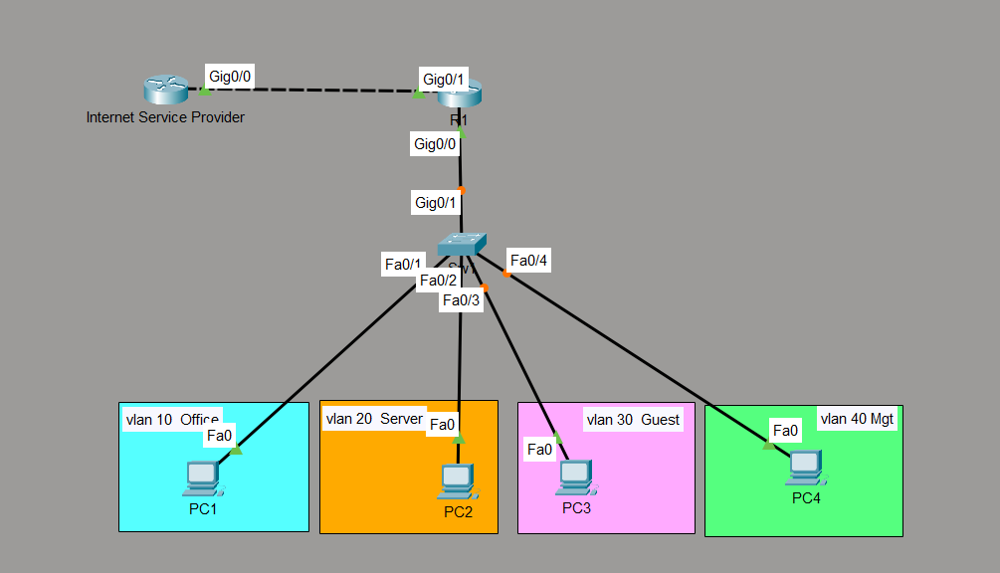
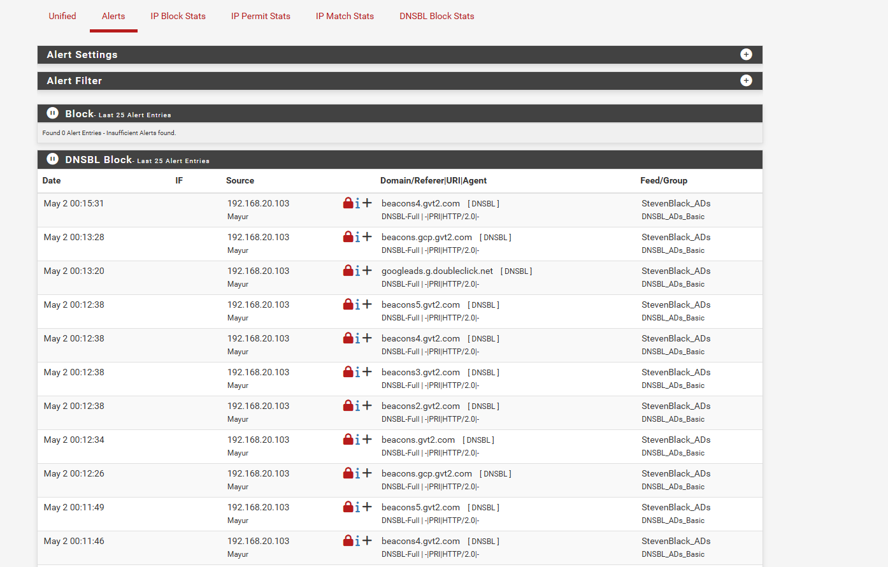
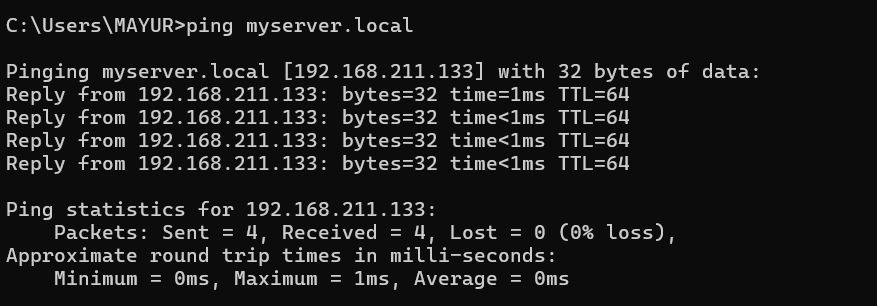
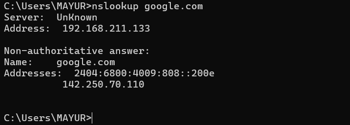
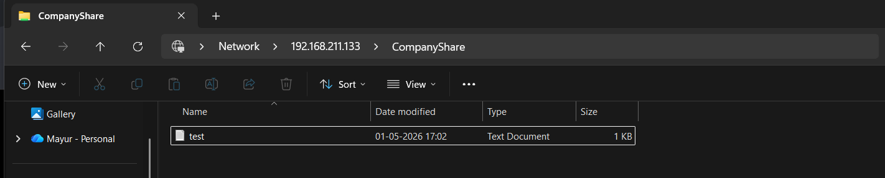
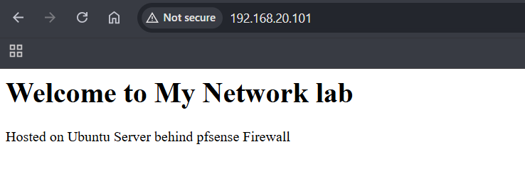
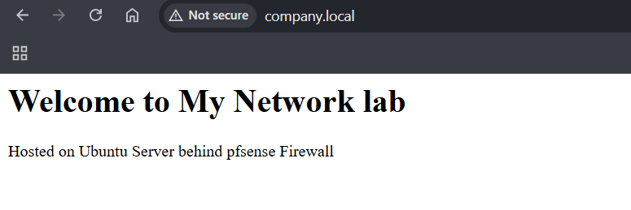
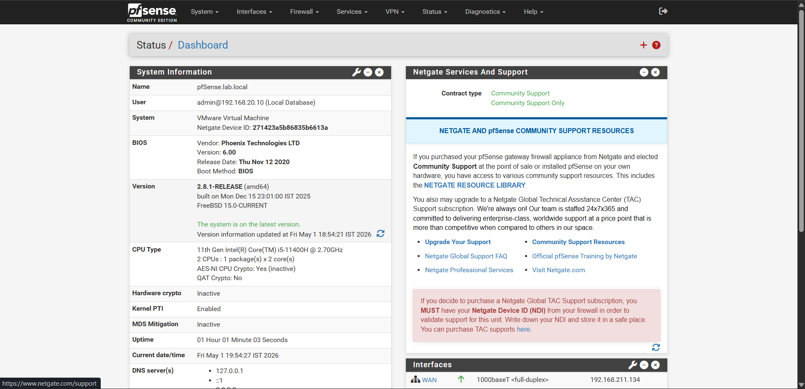
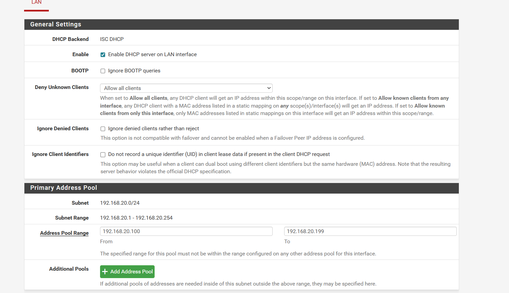
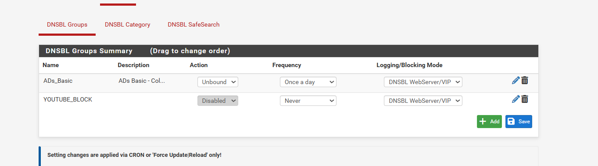

# 🏢 Mini Enterprise Network with Server Infrastructure

> A complete enterprise network simulation built from scratch as part of CCNA preparation —
> covering network design, server deployment, firewall configuration, and DNS-based content filtering.

**Author:** Mayur Garje
**Date:** May 2026
**Status:** ✅ Complete and Demo-Ready

---

## 📌 Project Summary

This project simulates a real small-company network environment — the kind a network engineer
would be asked to design and deploy on their first day at a job.

It is built in two parts:

| Part                        | Tool                      | What it covers                                                  |
| --------------------------- | ------------------------- | --------------------------------------------------------------- |
| **A — Network Design**      | Cisco Packet Tracer       | VLANs, inter-VLAN routing, ACLs, NAT                            |
| **B — Live Infrastructure** | VMware + Ubuntu + pfSense | DNS, DHCP, web server, file server, firewall, content filtering |

Part A demonstrates **Cisco CLI and network design skills** — directly aligned with the CCNA exam.
Part B demonstrates **real server and firewall deployment skills** — running actual software on a live home network.

---

## 🎯 Real-World Problem Solved

| Problem                       | Solution                                    |
| ----------------------------- | ------------------------------------------- |
| No centralized IP management  | ISC-DHCP server on Ubuntu + pfSense DHCP    |
| No internal domain resolution | BIND9 DNS with custom zones (company.local) |
| No internal website           | Apache2 web server — company intranet page  |
| No secure file sharing        | Samba file server — accessible from Windows |
| No network-level security     | pfSense firewall with NAT and ACL rules     |
| Unrestricted internet access  | pfBlockerNG DNSBL — 17,000+ domains blocked |
| DNS bypass by users           | DNS enforcement — port 53 firewall rules    |

---

## 🗺️ Network Topology

### Part A — Cisco Packet Tracer



```
          [ Internet / ISP ]
                 |
           [ R1 — 2911 ]
      Inter-VLAN routing + NAT + ACL
                 |
           [ SW1 — 2960 ]
            802.1Q Trunk
         /    |    |    \
      VLAN10 VLAN20 VLAN30 VLAN40
      Office Server  Guest   Mgmt
```

### Part B — VMware (Live)

```
      [ Windows 11 Host PC ]
               |
        [ VMware NAT ]
        192.168.211.2
       /               \
[ pfSense VM ]    [ Ubuntu Server VM ]
WAN: 192.168.211.134   IP: 192.168.20.101
LAN: 192.168.20.1
DHCP | DNS | Firewall   DNS | DHCP | Apache | Samba
pfBlockerNG DNSBL
```

---

## 📋 VLAN Design (Part A)

| VLAN | Name       | Subnet          | Gateway      | Purpose                   |
| ---- | ---------- | --------------- | ------------ | ------------------------- |
| 10   | Office     | 192.168.10.0/24 | 192.168.10.1 | Employee workstations     |
| 20   | Server     | 192.168.20.0/24 | 192.168.20.1 | Internal servers          |
| 30   | Guest      | 192.168.30.0/24 | 192.168.30.1 | Internet-only access      |
| 40   | Management | 192.168.40.0/24 | 192.168.40.1 | Network device management |

---

## 🖥️ Services Deployed (Part B)

### Ubuntu Server VM — 192.168.20.101

| Service | Package  | Port | What it does                                       |
| ------- | -------- | ---- | -------------------------------------------------- |
| DNS     | BIND9    | 53   | Resolves company.local — forwards external queries |
| DHCP    | ISC-DHCP | 67   | Assigns IPs to LAN devices automatically           |
| Web     | Apache2  | 80   | Hosts company intranet page                        |
| Files   | Samba    | 445  | Shared folder accessible from Windows              |
| Remote  | OpenSSH  | 22   | Remote terminal access                             |

### pfSense Firewall VM — 192.168.20.1

| Function          | Details                                        |
| ----------------- | ---------------------------------------------- |
| Firewall          | 7 rules — stateful packet inspection           |
| NAT               | LAN → WAN translation for internet access      |
| DHCP              | 192.168.20.100 – 192.168.20.199 pool           |
| DNS Resolver      | Unbound with forwarding mode + domain override |
| DNS Enforcement   | Rules 2+3 — blocks external DNS bypass         |
| Content Filtering | pfBlockerNG DNSBL — 17,004 domains blocked     |

---

## 🔥 pfSense Firewall Rules

| #   | Status | Protocol | Source | Destination  | Port    | Purpose                              |
| --- | ------ | -------- | ------ | ------------ | ------- | ------------------------------------ |
| 1   | ✅     | Any      | Any    | LAN Address  | 80, 443 | Anti-lockout — GUI always accessible |
| 2   | ✅     | TCP      | Any    | 192.168.20.1 | 53      | Allow DNS to pfSense                 |
| 3   | ❌\*   | TCP/UDP  | Any    | Any          | 53      | Block external DNS — no bypass       |
| 4   | 🔶     | IPv4     | Any    | pfB_PRI1_v4  | Any     | pfBlockerNG IP block (auto)          |
| 5   | ❌     | TCP/UDP  | Any    | BLOCK_SITES  | Any     | Block Social Media (disabled)        |
| 6   | ✅     | IPv4     | LAN    | Any          | Any     | Default allow LAN to internet        |
| 7   | ✅     | IPv6     | LAN    | Any          | Any     | Default allow LAN IPv6               |

\*Rule 3 is the DNS enforcement rule — when enabled, clients cannot bypass pfBlockerNG
by changing their DNS to 8.8.8.8.

---

## 🚫 Content Filtering — pfBlockerNG

### How it works

```
Client: what is youtube.com?
    → pfSense DNS (192.168.20.1:53)
    → pfBlockerNG DNSBL intercepts
    → Returns: 10.10.10.1 (sinkhole)
    → Client connects to 10.10.10.1 → nothing there
    → YouTube inaccessible ✅
```

### Block lists active

| Feed                  | Domains     | Updates |
| --------------------- | ----------- | ------- |
| StevenBlack_ADs       | 16,998      | Daily   |
| Custom_List (YouTube) | 6           | Manual  |
| **Total**             | **17,004+** | —       |

### YouTube domains blocked

```
youtube.com
www.youtube.com
m.youtube.com
ytimg.com
googlevideo.com
youtu.be
```

### Proof — YouTube blocked


```
C:\Users\MAYUR> nslookup youtube.com
Server:   pfSense.lab.local
Address:  192.168.20.1

Name:     youtube.com
Address:  10.10.10.1    ← sinkhole IP — blocked ✅
```

### Live block alerts



Real-time proof of pfBlockerNG actively blocking advertising
and tracking domains from the Windows PC.

---

## 📸 Key Screenshots

### Network Topology


_4-VLAN enterprise topology in Cisco Packet Tracer_

### DNS Verification


_Windows pinging myserver.local — DNS resolving correctly_


_External DNS forwarding working — google.com resolves via Ubuntu BIND9_

### Samba File Server


_Windows File Explorer accessing CompanyShare on Linux server_

### Apache Web Server


_Company intranet page accessed by IP_


_Company intranet page accessed by domain name — full DNS chain working_

### pfSense Dashboard


_pfSense dashboard showing both interfaces UP_

### pfSense DHCP


_DHCP pool 192.168.20.100 – 192.168.20.199 configured_

### pfBlockerNG


_DNSBL groups — ADs_Basic active with 16,998 domains_

### YouTube Blocked


_YouTube resolves to sinkhole 10.10.10.1 — blocked_

### Live Block Alerts


_Real-time DNSBL block log — advertising beacons blocked automatically_

---

## 📁 Documentation

| Document                                                          | Contents                                                  |
| ----------------------------------------------------------------- | --------------------------------------------------------- |
| [01-NETWORK-TOPOLOGY.md](docs/01-NETWORK-TOPOLOGY.md)             | Full network design — VLANs, IP addressing, traffic flows |
| [02-UBUNTU-SERVER-SETUP.md](docs/02-UBUNTU-SERVER-SETUP.md)       | DNS, DHCP, Apache, Samba — complete setup guide           |
| [03-PFSENSE-SETUP.md](docs/03-PFSENSE-SETUP.md)                   | pfSense install, wizard, DHCP, DNS resolver, gateways     |
| [04-PFSENSE-FIREWALL-RULES.md](docs/04-PFSENSE-FIREWALL-RULES.md) | All 7 rules — DNS enforcement architecture explained      |
| [05-PFBLOCKERNG-SETUP.md](docs/05-PFBLOCKERNG-SETUP.md)           | pfBlockerNG install, DNSBL, YouTube block, reports        |
| [06-TROUBLESHOOTING.md](docs/06-TROUBLESHOOTING.md)               | 12 real errors faced — root cause and fix for each        |
| [07-RESUME-AND-LINKEDIN.md](docs/07-RESUME-AND-LINKEDIN.md)       | Resume bullets and LinkedIn post                          |

---

## 🛠️ Tools & Technologies

| Tool                   | Version       | Purpose            | Cost            |
| ---------------------- | ------------- | ------------------ | --------------- |
| Cisco Packet Tracer    | Latest        | Network simulation | Free (NetAcad)  |
| VMware Workstation Pro | Latest        | VM host            | Free (personal) |
| Ubuntu Server          | 22.04 LTS     | Server OS          | Free            |
| BIND9                  | 9.18          | DNS server         | Free            |
| ISC-DHCP               | 4.4           | DHCP server        | Free            |
| Apache2                | 2.4           | Web server         | Free            |
| Samba                  | 4.x           | File server        | Free            |
| pfSense                | 2.8.1-RELEASE | Firewall           | Free            |
| pfBlockerNG            | 3.2.8         | Content filtering  | Free            |
| OpenSSH                | Built-in      | Remote access      | Free            |

**Total cost: ₹0**

---

## ⚠️ Known Limitations

**1. Packet Tracer is simulated — not connected to VMs**
Packet Tracer runs in an isolated simulation environment. It cannot
communicate with VMware VMs or real network devices. Part A demonstrates
Cisco CLI skills; Part B demonstrates real deployment skills. They are
intentionally separate.

**2. No VLANs in Part B**
The VMware setup uses a flat 192.168.20.0/24 network. VLAN segmentation
is fully demonstrated in Part A. VMware Workstation Pro does not support
managed VLAN switching without additional hardware or vSphere Enterprise.

**3. SSH hardening is basic**
Root login is disabled (PermitRootLogin no) but key-based authentication
was not implemented. Password authentication is still enabled. Full SSH
key hardening is planned as a next phase improvement.

**4. Samba has no user authentication**
The CompanyShare is configured with `guest ok = yes` — no password
required. In production, user-based authentication with Samba groups
would be configured.

**5. No SSL on Apache**
The intranet page runs on HTTP (port 80). No SSL certificate is configured.
In production, Let's Encrypt or an internal CA would be used.

---

## 🔧 Errors Faced & Fixed

12 real errors were encountered and fixed during this project.
Full documentation in [06-TROUBLESHOOTING.md](docs/06-TROUBLESHOOTING.md).

Quick summary:

| Error                         | Fix                                        |
| ----------------------------- | ------------------------------------------ |
| VMware copy-paste not working | Installed open-vm-tools                    |
| bind9.service alias refused   | Used named instead of bind9                |
| DNS timeout from Windows      | Added listen-on to named.conf.options      |
| DHCP not assigning IPs        | Set INTERFACESv4="ens33"                   |
| pfSense TTL expired           | Explicitly set default gateway to WAN_DHCP |
| pfBlockerNG not blocking      | Ran Force Reload → All after saving        |
| DNS enforcement broke all DNS | Moved allow rule before block rule         |

---

## 🧠 What I Learned

- How VLANs segment a network and why companies use them
- Router-on-a-stick inter-VLAN routing using 802.1Q sub-interfaces
- How NAT/PAT translates private IPs to a single public IP
- How ACLs enforce traffic rules between network segments
- BIND9 DNS server — forward zones, reverse zones, forwarders
- ISC-DHCP server — scopes, options, interface binding
- Apache2 web server — hosting and accessing via hostname
- Samba file server — cross-platform Linux/Windows file sharing
- pfSense firewall — installation, NAT, DHCP, DNS resolver
- Firewall rule order — why specific rules must come before general
- DNS enforcement — allow pfSense DNS, block all external DNS
- pfBlockerNG DNSBL — how DNS sinkholes work
- Difference between IP-based and DNS-based content filtering
- FreeBSD vs Linux service management differences
- Reading system logs — distinguishing real errors from noise
- Real troubleshooting — 12 problems, 12 fixes, 0 factory resets

---

## 📝 Resume Bullets

```
• Designed a 4-VLAN enterprise network topology in Cisco Packet Tracer
  with router-on-a-stick inter-VLAN routing, 802.1Q trunking, extended
  ACLs and NAT/PAT — simulating a complete office network infrastructure.

• Deployed Ubuntu Server 22.04 on VMware with BIND9 DNS (forward/reverse
  zones for company.local), ISC-DHCP server, Apache2 web server with
  custom intranet page, and Samba file server accessible from Windows.

• Configured pfSense firewall with NAT, DHCP, DNS resolver with forwarding
  mode and domain override — enforced DNS routing via firewall rules
  preventing clients from bypassing internal DNS using external resolvers.

• Implemented pfBlockerNG DNSBL content filtering with StevenBlack_ADs
  feed (16,998 blocked domains) and custom YouTube CDN block list —
  verified blocking via nslookup returning sinkhole IP 10.10.10.1;
  confirmed real-time alerts in pfBlockerNG Reports dashboard.
```

---

## 📬 Contact

**Mayur Garje**
Preparing for CCNA certification | Network Engineering

---

_This project was built entirely on a personal Windows 11 laptop using
free and open-source tools. No physical Cisco hardware was used for Part B._
