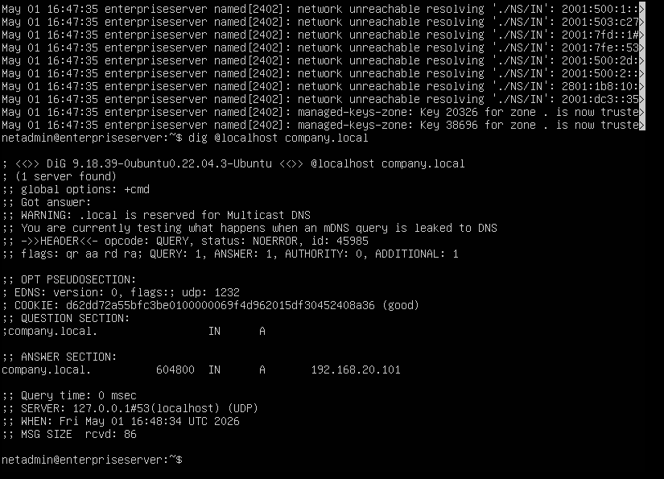
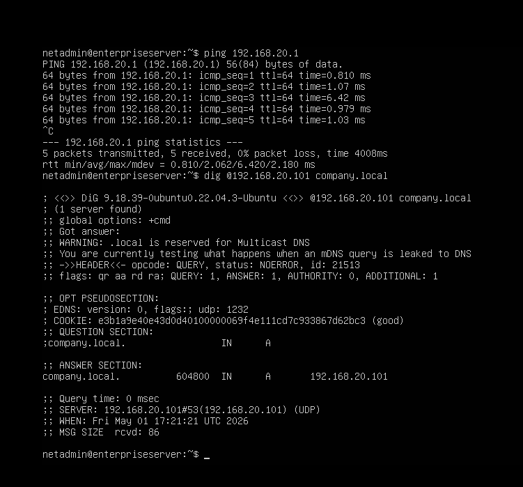

# 🖥️ Ubuntu Server Setup

### Mini Enterprise Network — Mayur Garje

---

## Overview

The Ubuntu Server VM is the core of Part B — it runs four real services that
any enterprise network would have:

| Service     | Package  | Purpose                                        |
| ----------- | -------- | ---------------------------------------------- |
| DNS Server  | BIND9    | Resolves internal domain names (company.local) |
| DHCP Server | ISC-DHCP | Automatically assigns IPs to LAN devices       |
| Web Server  | Apache2  | Hosts company intranet page                    |
| File Server | Samba    | Shared network folder accessible from Windows  |

All four services run simultaneously on a single Ubuntu Server VM hosted
in VMware Workstation Pro on Windows 11.

---

## VM Specifications

| Setting         | Value                                      |
| --------------- | ------------------------------------------ |
| OS              | Ubuntu Server 22.04 LTS                    |
| RAM             | 2048 MB (2GB)                              |
| Disk            | 20 GB (dynamically allocated)              |
| CPU             | 2 cores                                    |
| Network Adapter | Bridged / Custom (VMware internal network) |
| Hostname        | enterpriseserver                           |
| Admin User      | netadmin                                   |
| Static IP       | 192.168.20.101                             |
| Gateway         | 192.168.20.1 (pfSense LAN)                 |

---

## Part 1 — VM Creation in VMware

### Steps followed in VMware Workstation Pro

1. Open VMware → Create a New Virtual Machine → Typical
2. Select installer disc image (ISO) → browse to Ubuntu Server 22.04 ISO
3. Set VM name: `Enterprise-Server-VLAN20`
4. Disk: 20GB → Store as single file
5. Customize Hardware:
   - RAM: 2048 MB
   - Processors: 2
   - Network Adapter: **Custom (VMnet — same as pfSense LAN)**
6. Finish → VM boots and installs Ubuntu automatically

### Ubuntu Installation choices

- Storage: Use entire disk (default)
- Username: `netadmin`
- Hostname: `enterpriseserver`
- OpenSSH: Install (checked during install)
- No snaps selected

---

## Part 2 — Initial System Configuration

### First login and system update

After Ubuntu installs and reboots, log in and immediately update:

```bash
sudo apt update && sudo apt upgrade -y
```

### Set hostname

```bash
sudo hostnamectl set-hostname enterpriseserver
```

Verify:

```bash
hostnamectl
```

### Install VMware Tools (for clipboard and display)

```bash
sudo apt install open-vm-tools open-vm-tools-desktop -y
sudo reboot
```

> **Error faced:** Copy-paste between VMware and Ubuntu was greyed out.
> **Fix:** VMware Tools was not installed. After installing `open-vm-tools`,
> copy-paste worked correctly.

---

## Part 3 — Static IP Configuration

The server must always have the same IP address so other devices can
reliably find it. A DHCP-assigned IP would change on every reboot.

### Find network interface name

```bash
ip a
```

Look for the interface name — in VMware it is typically `ens33`.

### Edit netplan configuration

```bash
sudo nano /etc/netplan/00-installer-config.yaml
```

Replace everything with:

```yaml
network:
  version: 2
  ethernets:
    ens33:
      dhcp4: false
      addresses:
        - 192.168.20.101/24
      routes:
        - to: default
          via: 192.168.20.1
      nameservers:
        addresses: [8.8.8.8, 8.8.4.4]
```

Apply the configuration:

```bash
sudo netplan apply
```

Verify IP is set correctly:

```bash
ip a show ens33
```

Expected output:

```
inet 192.168.20.101/24 brd 192.168.20.255 scope global ens33
```

Test internet connectivity:

```bash
ping google.com -c 4
```

All 4 packets should return successfully.

---

## Part 4 — BIND9 DNS Server

### What BIND9 does in this project

BIND9 (Berkeley Internet Name Domain) is the most widely used DNS server
software in the world. In this project it serves as the authoritative DNS
server for the internal domain `company.local` — meaning it is the final
authority on what IP addresses internal hostnames resolve to.

When a device on the network queries `company.local` or `www.company.local`,
pfSense forwards that query to this BIND9 server, which answers from its
zone file.

### Installation

```bash
sudo apt install bind9 bind9utils bind9-doc -y
```

Verify service started:

```bash
sudo systemctl status bind9
```

### Configuration File 1 — named.conf.options

This file controls global DNS behaviour — who can query, where to forward
unknown requests, and what interfaces to listen on.

```bash
sudo nano /etc/bind/named.conf.options
```

Contents:

```
options {
    directory "/var/cache/bind";

    // Allow queries from internal network only
    allow-query { 192.168.0.0/16; localhost; };

    // Forward external queries to Google DNS
    forwarders {
        8.8.8.8;
        8.8.4.4;
    };

    forward only;
    dnssec-validation auto;

    // Listen on localhost and server IP
    listen-on { 127.0.0.1; 192.168.20.101; };
};
```

### Configuration File 2 — named.conf.local

This file declares which zones BIND9 is authoritative for — both forward
(name → IP) and reverse (IP → name).

```bash
sudo nano /etc/bind/named.conf.local
```

Contents:

```
// Forward zone — resolves company.local names to IPs
zone "company.local" {
    type master;
    file "/etc/bind/zones/db.company.local";
};

// Reverse zone — resolves IPs back to names
zone "20.168.192.in-addr.arpa" {
    type master;
    file "/etc/bind/zones/db.192.168.20";
};
```

### Create zones directory

```bash
sudo mkdir /etc/bind/zones
```

### Configuration File 3 — Forward Zone File

This file maps hostnames to IP addresses for the `company.local` domain.

```bash
sudo nano /etc/bind/zones/db.company.local
```

Contents:

```
$TTL    604800
@   IN  SOA ns1.company.local. admin.company.local. (
                  2         ; Serial
             604800         ; Refresh (7 days)
              86400         ; Retry (1 day)
            2419200         ; Expire (28 days)
             604800 )       ; Negative Cache TTL (7 days)

; Name server record
@       IN  NS      ns1.company.local.

; A records — hostname to IP mappings
ns1         IN  A   192.168.20.101
server      IN  A   192.168.20.101
www         IN  A   192.168.20.101
files       IN  A   192.168.20.101
company     IN  A   192.168.20.101
```

### Configuration File 4 — Reverse Zone File

This file maps IP addresses back to hostnames (PTR records).

```bash
sudo nano /etc/bind/zones/db.192.168.20
```

Contents:

```
$TTL    604800
@   IN  SOA ns1.company.local. admin.company.local. (
                  1         ; Serial
             604800         ; Refresh
              86400         ; Retry
            2419200         ; Expire
             604800 )       ; Negative Cache TTL

; Name server
@       IN  NS      ns1.company.local.

; PTR records — IP to hostname mappings
101     IN  PTR     server.company.local.
```

### Check configuration for errors

Always run these checks before restarting — they catch typos that would
silently break DNS:

```bash
# Check main config syntax
sudo named-checkconf

# Check forward zone file
sudo named-checkzone company.local /etc/bind/zones/db.company.local

# Check reverse zone file
sudo named-checkzone 20.168.192.in-addr.arpa /etc/bind/zones/db.192.168.20
```

All three commands should return `OK` or `zone loaded successfully`.

### Start and enable BIND9

```bash
sudo systemctl restart bind9
sudo systemctl enable bind9
sudo systemctl status bind9
```

Status should show `active (running)`.

### Verification — from Ubuntu server itself

```bash
# Test internal zone resolution
dig @localhost company.local
```




_(Shows dig output with ANSWER SECTION returning 192.168.20.101)_

Expected answer section:

```
;; ANSWER SECTION:
company.local.    604800    IN    A    192.168.20.101
;; SERVER: 127.0.0.1#53(localhost) (UDP)
;; Query time: 0 msec
```

```bash
# Test external forwarding works
dig @localhost google.com
```

Google should resolve — confirming the forwarders (8.8.8.8) are reachable.

### Verification — from Ubuntu server querying by IP

```bash
ping 192.168.20.1
dig @192.168.20.101 company.local
```




_(Shows ping to pfSense succeeding + dig result from network IP)_

This confirms BIND9 is listening on the network interface — not just
loopback. Windows clients need to reach it by IP, not just localhost.

### Verification — from Windows CMD

```bash
nslookup company.local
```

Expected output:

```
Server:   Unknown
Address:  192.168.20.101

Name:    company.local
Address: 192.168.20.101
```

```bash
ping myserver.local
```


_(Shows Windows pinging myserver.local — resolves to 192.168.20.101)_

### Verification — external DNS forwarding from Windows

```bash
nslookup google.com
```


_(Shows nslookup with server 192.168.20.101 resolving google.com)_

This confirms:

- Windows is using the Ubuntu DNS server
- Ubuntu BIND9 is forwarding external queries to 8.8.8.8
- Full DNS chain is working end to end

### Errors faced during BIND9 setup

**Error 1: `bind9.service` alias refused**

```
Refusing to operate on alias name: bind9.service
```

Cause: On Ubuntu 22.04, the service is named `named` internally,
and `bind9` is just an alias that some commands reject.

Fix: Use `named` directly:

```bash
sudo systemctl restart named
sudo systemctl enable named
sudo systemctl status named
```

**Error 2: DNS request timed out from Windows**

```
DNS request timed out.
Server: Unknown
```

Cause: BIND9 was only listening on `127.0.0.1` — not on the network
interface `192.168.20.101`. Windows clients could not reach it.

Fix: Added `listen-on { 127.0.0.1; 192.168.20.101; };` to
`named.conf.options` and restarted.

**Error 3: IPv6 network unreachable in syslog**

```
named[2402]: network unreachable resolving './NS/IN': 2001:500:1::
```

Cause: BIND9 tried to reach IPv6 root nameservers but no IPv6 was
configured in the lab.

Fix: These are harmless informational messages — IPv4 DNS worked
perfectly. No action needed.

---

## Part 5 — ISC-DHCP Server

### What DHCP does in this project

The DHCP server automatically assigns IP addresses, subnet masks,
gateways, and DNS server addresses to any device that connects to the
network. Without DHCP, every device would need a manually configured
static IP.

> **Note:** In the final project setup, pfSense took over DHCP duties for
> the 192.168.20.0/24 network. The Ubuntu DHCP server was configured and
> tested during the initial phase before pfSense was introduced.

### Installation

```bash
sudo apt install isc-dhcp-server -y
```

### Configure listening interface

```bash
sudo nano /etc/default/isc-dhcp-server
```

Find and set:

```
INTERFACESv4="ens33"
```

This tells the DHCP server to only listen on the ens33 interface —
not all interfaces.

### Main DHCP configuration

```bash
sudo nano /etc/dhcp/dhcpd.conf
```

Contents:

```
# Global settings
option domain-name "company.local";
option domain-name-servers 192.168.20.101;
default-lease-time 86400;
max-lease-time 172800;
authoritative;

# LAN subnet — 192.168.20.0/24
subnet 192.168.20.0 netmask 255.255.255.0 {
    range 192.168.20.100 192.168.20.199;
    option routers 192.168.20.1;
    option domain-name-servers 192.168.20.101;
    option domain-name "company.local";
}
```

### Start and enable

```bash
sudo systemctl restart isc-dhcp-server
sudo systemctl enable isc-dhcp-server
sudo systemctl status isc-dhcp-server
```

### Verification

Check active leases:

```bash
cat /var/lib/dhcp/dhcpd.leases
```

Watch live DHCP activity:

```bash
sudo tail -f /var/log/syslog | grep dhcp
```

### Error faced

**Error: DHCP not assigning IPs**

Cause: Interface was not specified — DHCP tried to listen on all interfaces
including loopback, which caused it to fail silently.

Fix: Added `INTERFACESv4="ens33"` to `/etc/default/isc-dhcp-server` and
restarted the service.

---

## Part 6 — Apache2 Web Server

### What Apache does in this project

Apache2 hosts a company intranet page accessible to any device on the
LAN by IP address or by domain name (`company.local`). This simulates
the internal web portals that companies use for announcements, links,
and IT resources.

### Installation

```bash
sudo apt install apache2 -y
sudo systemctl enable apache2
sudo systemctl start apache2
```

Verify it is running:

```bash
sudo systemctl status apache2
curl http://localhost
```

### Create the company intranet page

Replace the default Apache page:

```bash
sudo nano /var/www/html/index.html
```

Contents used in this project:

```html
<!DOCTYPE html>
<html>
  <head>
    <title>My Network Lab</title>
  </head>
  <body>
    <h1>Welcome to My Network lab</h1>
    <p>Hosted on Ubuntu Server behind pfSense Firewall</p>
  </body>
</html>
```

### Verification — access by IP address

From any browser on the LAN:

```
http://192.168.20.101
```


_(Shows browser at 192.168.20.101 displaying "Welcome to My Network lab")_

### Verification — access by domain name

```
http://company.local
```


_(Shows browser at company.local displaying the same page)_

Accessing by domain name proves the full DNS → HTTP chain is working:

1. Browser asks DNS for `company.local`
2. pfSense forwards to BIND9 on Ubuntu
3. BIND9 returns `192.168.20.101`
4. Browser connects to Apache on that IP
5. Page is served successfully

### What "Not secure" in the browser means

The browser shows a warning because the site is HTTP (not HTTPS).
No SSL certificate is configured — this is expected in a lab environment.
In production, a certificate would be installed using Let's Encrypt or
an internal CA.

---

## Part 7 — Samba File Server

### What Samba does in this project

Samba allows Windows clients to access shared folders on a Linux server
using the standard Windows file sharing protocol (SMB/CIFS). The shared
folder appears in Windows File Explorer exactly like any other network
drive — no additional software needed on the Windows side.

### Installation

```bash
sudo apt install samba -y
```

### Create the shared directory

```bash
sudo mkdir -p /srv/samba/shared
sudo chmod 777 /srv/samba/shared
```

`chmod 777` gives full read/write/execute permissions to all users —
appropriate for an open lab share.

### Configure Samba

```bash
sudo nano /etc/samba/smb.conf
```

Add at the bottom of the file:

```ini
[CompanyShare]
   path = /srv/samba/shared
   browseable = yes
   writable = yes
   guest ok = yes
   read only = no
```

| Setting    | Value             | Meaning                             |
| ---------- | ----------------- | ----------------------------------- |
| path       | /srv/samba/shared | Physical location on Linux disk     |
| browseable | yes               | Share appears when browsing network |
| writable   | yes               | Users can create and edit files     |
| guest ok   | yes               | No password required to access      |
| read only  | no                | Not read-only — full write access   |

### Create a Samba user

```bash
sudo smbpasswd -a netadmin
```

Enter a password when prompted. This creates a Samba-specific password
separate from the Linux login password.

### Restart Samba

```bash
sudo systemctl restart smbd
sudo systemctl enable smbd
sudo systemctl status smbd
```

### Verify shared folder on Linux side

```bash
ls -ld /srv/samba/shared
ls /srv/samba/shared
```


_(Shows terminal with drwxrwxrwx permissions and test.txt inside)_

Expected output:

```
drwxrwxrwx 2 root root 4096 May  1 11:14 /srv/samba/shared
test.txt
```

### Access from Windows

Open File Explorer and type in the address bar:

```
\\192.168.20.101\CompanyShare
```

Or press Win+R and type the same path.


_(Shows Windows File Explorer at \\192.168.211.133\CompanyShare with test.txt visible)_

The `test.txt` file visible in Windows was created on the Linux server —
confirming files sync in real time between Linux and Windows.

### Error faced

**Error: Cannot open shared folder from Windows**

Cause: The shared directory had incorrect permissions — Samba could see
the folder but the process running Samba did not have permission to
read its contents.

Fix:

```bash
sudo chmod 777 /srv/samba/shared
sudo systemctl restart smbd
```

After this, Windows access worked immediately.

---

## Part 8 — SSH Remote Access

### What SSH provides

SSH (Secure Shell) allows remote login to the Ubuntu server from any
machine on the LAN. Instead of typing commands directly on the VM
console, the terminal on the Windows host can be used.

### Installation

OpenSSH server is installed during Ubuntu setup if the option is
selected. If not:

```bash
sudo apt install openssh-server -y
```

### Enable and start

```bash
sudo systemctl enable ssh
sudo systemctl start ssh
sudo systemctl status ssh
```

### Basic hardening applied

```bash
sudo nano /etc/ssh/sshd_config
```

Changes made:

```
PermitRootLogin no
PasswordAuthentication yes
```

`PermitRootLogin no` prevents anyone from SSHing directly as root —
a common attack target.

Restart SSH after changes:

```bash
sudo systemctl restart ssh
```

### Connect from Windows

Open Windows Terminal or CMD:

```bash
ssh netadmin@192.168.20.101
```

> **Note:** Full SSH key-based authentication (disabling password login
> entirely) was not implemented in this project — that is a planned
> improvement for the next phase.

---

## Part 9 — Open Firewall Ports on Ubuntu

Ubuntu's built-in firewall (UFW) must allow traffic on the ports each
service uses:

```bash
sudo ufw allow 22/tcp      # SSH
sudo ufw allow 53          # DNS (TCP + UDP)
sudo ufw allow 67/udp      # DHCP
sudo ufw allow 80/tcp      # HTTP (Apache)
sudo ufw allow 443/tcp     # HTTPS (future use)
sudo ufw allow 137,138/udp # Samba NetBIOS
sudo ufw allow 139,445/tcp # Samba SMB

sudo ufw enable
sudo ufw status
```

---

## Part 10 — Final Service Verification

Run all of these after completing setup — everything should pass:

```bash
# Check all services are running
sudo systemctl status named
sudo systemctl status isc-dhcp-server
sudo systemctl status apache2
sudo systemctl status smbd

# DNS resolves internal names
nslookup company.local 127.0.0.1

# DNS forwards external names
nslookup google.com 127.0.0.1

# Web server responds
curl -I http://192.168.20.101

# DHCP is listening on port 67
sudo ss -ulnp | grep :67

# Samba is listening on port 445
sudo ss -tlnp | grep :445

# Check DHCP leases
cat /var/lib/dhcp/dhcpd.leases

# Check Samba shared folder
ls -la /srv/samba/shared
```

---

## Summary — All Services Running

| Service | Package       | Port | Status    | Verified By           |
| ------- | ------------- | ---- | --------- | --------------------- |
| DNS     | BIND9 (named) | 53   | ✅ Active | nslookup + dig        |
| DHCP    | ISC-DHCP      | 67   | ✅ Active | Client IP assignment  |
| Web     | Apache2       | 80   | ✅ Active | Browser + curl        |
| Files   | Samba (smbd)  | 445  | ✅ Active | Windows File Explorer |
| Remote  | OpenSSH       | 22   | ✅ Active | SSH from Windows      |

---

## What This Demonstrates

Running four production-grade services on a single Ubuntu Server VM
mirrors exactly what a junior network or sysadmin engineer would be
asked to set up in a small company environment. Every package used
(BIND9, ISC-DHCP, Apache2, Samba) is industry-standard software used
in real enterprise deployments.

The key skills demonstrated:

- Linux server administration (Ubuntu Server 22.04)
- Static IP configuration using Netplan
- Authoritative DNS server setup with forward and reverse zones
- DHCP scope configuration with domain and DNS options pushed to clients
- Web server deployment and custom HTML hosting
- Cross-platform file sharing between Linux and Windows
- Basic SSH hardening
- UFW firewall port management
- Service troubleshooting using systemctl, journalctl, and dig

---

_Document: 02-UBUNTU-SERVER-SETUP.md_
_Project: Mini Enterprise Network_
_Author: Mayur Garje_
_Date: May 2026_
