# 🔥 pfSense Firewall Setup

### Mini Enterprise Network — Mayur Garje

---

## Overview

pfSense is a free, open-source firewall and router operating system based
on FreeBSD. In this project it acts as the network's security boundary —
every packet entering or leaving the LAN passes through pfSense.

### What pfSense handles in this project

| Function          | Details                                                        |
| ----------------- | -------------------------------------------------------------- |
| Firewall          | Stateful packet inspection — allows or blocks traffic by rules |
| NAT               | Translates private LAN IPs to WAN IP for internet access       |
| DHCP Server       | Automatically assigns IPs to all LAN devices                   |
| DNS Resolver      | Forwards DNS queries, enforces internal domain resolution      |
| DNS Enforcement   | Blocks clients from using external DNS servers                 |
| Content Filtering | pfBlockerNG DNSBL — blocks domains at DNS level                |
| Routing           | Routes traffic between WAN and LAN                             |

### Why pfSense instead of a simpler solution

pfSense is the same category of product as Cisco ASA, Fortinet FortiGate,
and Palo Alto firewalls — enterprise-grade stateful firewalls. It is used
by small businesses, universities, ISPs, and home labs worldwide. Running
pfSense in this project demonstrates real firewall administration skills,
not just basic router configuration.

---

## VM Specifications

| Setting           | Value                                  |
| ----------------- | -------------------------------------- |
| OS                | pfSense 2.8.1-RELEASE (amd64)          |
| Based on          | FreeBSD 15.0-CURRENT                   |
| RAM               | 1024 MB (1GB)                          |
| Disk              | 16 GB                                  |
| CPU               | 2 cores (shared from host i5-11400H)   |
| Network Adapter 1 | NAT → WAN interface (em0)              |
| Network Adapter 2 | Custom/Host-only → LAN interface (em1) |
| Hostname          | pfSense                                |
| Domain            | lab.local                              |
| WAN IP            | 192.168.211.134 (DHCP from VMware NAT) |
| LAN IP            | 192.168.20.1 (static — manually set)   |

---

## Part 1 — pfSense Installation

### Download

pfSense Community Edition ISO downloaded from:
`https://www.pfsense.org/download/`

Version used: **pfSense-CE-2.8.1-RELEASE-amd64.iso**

### VMware VM Creation

1. Open VMware Workstation Pro → New Virtual Machine → Typical
2. Select ISO → browse to pfSense ISO
3. Guest OS: Other → FreeBSD 64-bit
4. VM Name: `pfSense-Firewall`
5. Disk: 16GB → Single file
6. Customize Hardware:
   - RAM: 1024 MB
   - Processors: 2
   - **Network Adapter 1:** NAT ← this becomes WAN
   - **Network Adapter 2:** Custom (VMnet same as Ubuntu) ← this becomes LAN
7. Finish

### Installation process

Boot from ISO → pfSense installer starts automatically:

- Accept copyright notice
- Select **Install pfSense**
- Keymap: Default (US)
- Partitioning: **Auto (ZFS)** → Stripe (no redundancy for single disk)
- Confirm disk selection → installation begins
- When complete: **Reboot**
- Remove ISO from VMware after reboot

---

## Part 2 — First Boot and Console Setup

### Screenshot

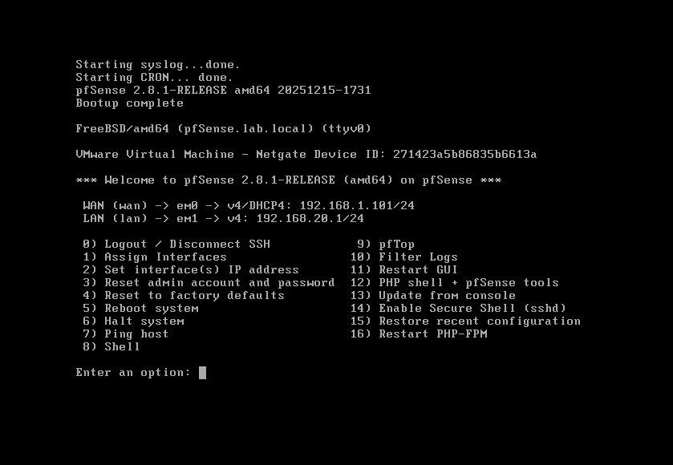

_(Shows pfSense boot sequence with WAN and LAN interface assignment)_

After reboot, the pfSense console menu appears showing:

```
pfSense 2.8.1-RELEASE amd64 20251215-1731
Bootup complete

FreeBSD/amd64 (pfSense.lab.local) (ttyv0)
VMware Virtual Machine — Netgate Device ID: 271423a5b86835b6613a

*** Welcome to pfSense 2.8.1-RELEASE (amd64) on pfSense ***

WAN (wan) → em0 → v4/DHCP4: 192.168.1.101/24
LAN (lan) → em1 → v4: 192.168.20.1/24
```

### Console menu options

The console provides 16 management options without needing a browser:

| Option | Function                             |
| ------ | ------------------------------------ |
| 1      | Assign Interfaces                    |
| 2      | Set interface(s) IP address          |
| 3      | Reset admin account and password     |
| 4      | Reset to factory defaults            |
| 5      | Reboot system                        |
| 8      | **Shell** — used for troubleshooting |
| 14     | Enable Secure Shell (sshd)           |

**Option 8 (Shell)** was used several times during troubleshooting to run
commands directly on the FreeBSD system.

### Interface assignment verification

At first boot pfSense auto-assigns:

- **em0 → WAN** (VMware NAT adapter → gets DHCP IP from VMware)
- **em1 → LAN** (Custom adapter → same network as Ubuntu VM)

If interfaces are wrong, Option 1 (Assign Interfaces) reassigns them.

---

## Part 3 — Web GUI Access

### Screenshot

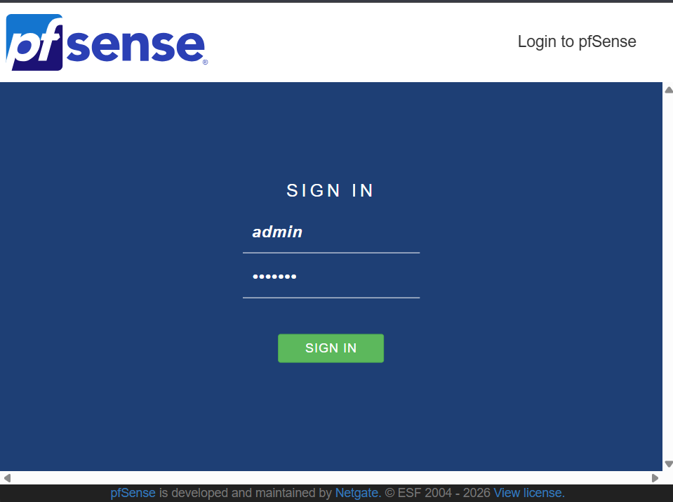

_(Shows pfSense login page at 192.168.20.1)_

The pfSense web GUI is accessed from the Windows host browser:

```
https://192.168.20.1
```

Default credentials:

- Username: `admin`
- Password: `pfsense`

> ⚠️ The web GUI shows a warning: **"The password for this account is
> insecure. Password is currently set to the default value (pfsense).
> Change the password as soon as possible."**
> This was changed during the setup wizard.

---

## Part 4 — Setup Wizard (9 Steps)

### Screenshot


_(Shows welcome screen of pfSense Setup Wizard)_

After first login, pfSense launches its setup wizard automatically.
The wizard runs through 9 configuration steps.

---

### Wizard Step 1 — Welcome

Welcome screen explaining the wizard. Click **Next** to begin.

---

### Wizard Step 2 — Netgate Registration

Option to register with Netgate (optional). Skipped for lab use.

---

### Wizard Step 3 — General Information

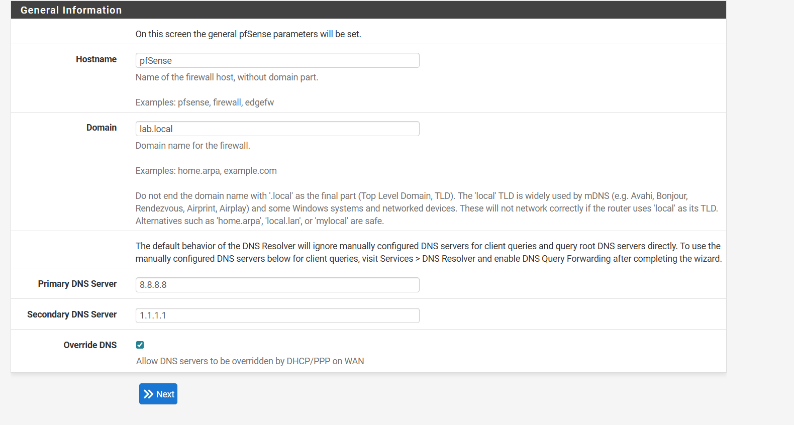

_(Shows hostname, domain, and DNS server configuration)_

| Field         | Value set   | Reason                                  |
| ------------- | ----------- | --------------------------------------- |
| Hostname      | `pfSense`   | Name of the firewall                    |
| Domain        | `lab.local` | Internal domain suffix for firewall     |
| Primary DNS   | `8.8.8.8`   | Google DNS for external resolution      |
| Secondary DNS | `1.1.1.1`   | Cloudflare DNS as backup                |
| Override DNS  | ✅ Checked  | Allows ISP/DHCP to update DNS if needed |

> **Note on domain:** pfSense documentation warns not to use `.local` as
> the TLD because it conflicts with mDNS (Bonjour/Avahi). `lab.local` was
> used here — in production `lab.lan` or `lab.internal` would be safer.

---

### Wizard Step 4 — Time Server

NTP time server set to: `2.pfsense.pool.ntp.org` (default)
Timezone set to: `Asia/Kolkata` (IST — UTC+5:30)

---

### Wizard Step 5 — WAN Interface

WAN interface configuration:

- **Type:** DHCP
- pfSense gets its WAN IP automatically from VMware NAT
- No PPPoE or static IP needed for this lab setup

---

### Wizard Step 6 — LAN Interface

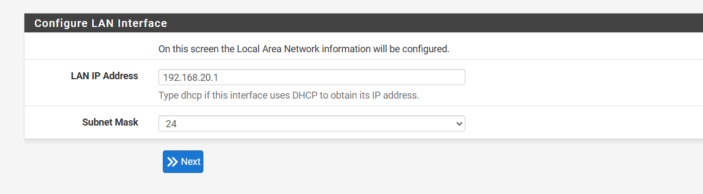

_(Shows LAN IP address set to 192.168.20.1 with /24 subnet mask)_

| Field          | Value                 |
| -------------- | --------------------- |
| LAN IP Address | `192.168.20.1`        |
| Subnet Mask    | `/24` (255.255.255.0) |

This IP becomes:

- The **default gateway** for all LAN devices
- The **DNS server** address pushed via DHCP to clients
- The address used to access the pfSense web GUI

---

### Wizard Step 7 — Set Admin Password

Default password `pfsense` changed to a strong password.
This closes the security warning shown on the dashboard.

---

### Wizard Step 8 — Reload Configuration

pfSense applies all wizard settings and restarts services.

---

### Wizard Step 9 — Completed

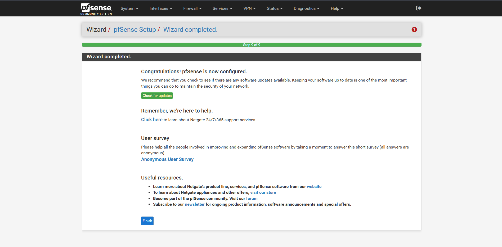

_(Shows "Wizard completed." with full green progress bar at Step 9 of 9)_

pfSense is now fully configured and operational. The green progress bar
confirms all 9 steps completed without errors.

---

## Part 5 — Dashboard Overview

### Screenshot 1 — System Information


_(Shows full system info panel — version, CPU, uptime, DNS servers)_

### Screenshot 2 — Interfaces and Resources

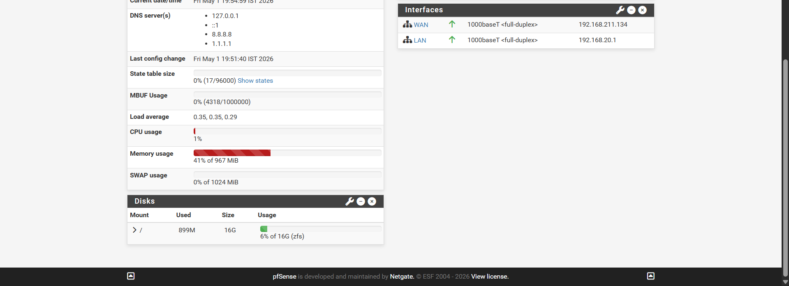

_(Shows WAN/LAN interface status + CPU/memory/disk usage)_

### Dashboard — key values confirmed

| Field       | Value                            | Meaning                     |
| ----------- | -------------------------------- | --------------------------- |
| Name        | pfSense.lab.local                | Firewall fully named        |
| Version     | 2.8.1-RELEASE (amd64)            | Latest stable release       |
| System      | VMware Virtual Machine           | Running in VMware correctly |
| Uptime      | 1 Hour 1 Minute                  | Stable after configuration  |
| Date/Time   | Fri May 1 19:54:27 IST 2026      | Correct timezone            |
| DNS servers | 127.0.0.1, ::1, 8.8.8.8, 1.1.1.1 | Using own resolver first    |
| WAN         | ↑ 192.168.211.134                | Connected to internet ✅    |
| LAN         | ↑ 192.168.20.1                   | Serving internal network ✅ |
| CPU usage   | 1%                               | Near-idle — efficient       |
| Memory      | 41% of 967 MiB                   | ~400MB used — healthy       |
| Disk        | 899MB used of 16GB (6%)          | Plenty of space             |

Both WAN and LAN show green UP arrows — firewall is fully operational.

---

## Part 6 — DHCP Server Configuration

### Screenshot


_(Shows DHCP settings with pool 192.168.20.100 to 192.168.20.199)_

### Navigation path

```
Services → DHCP Server → LAN
```

### Configuration applied

| Setting      | Value                           | Meaning                         |
| ------------ | ------------------------------- | ------------------------------- |
| DHCP Backend | ISC DHCP                        | Industry-standard DHCP software |
| Enable       | ✅ Enabled on LAN               | DHCP active on LAN interface    |
| Subnet       | 192.168.20.0/24                 | Network being served            |
| Address Pool | 192.168.20.100 – 192.168.20.199 | 100 IPs available for clients   |

### Why this IP range

| Range                 | Purpose                                   |
| --------------------- | ----------------------------------------- |
| 192.168.20.1          | pfSense LAN gateway (reserved)            |
| 192.168.20.2 – .99    | Static IPs for servers and infrastructure |
| 192.168.20.100 – .199 | DHCP pool — dynamic client IPs            |
| 192.168.20.200 – .254 | Reserved for future use                   |

Ubuntu server sits at `192.168.20.101` — inside the static range,
not the DHCP pool, so pfSense DHCP never accidentally assigns that IP
to another device.

### Applied successfully

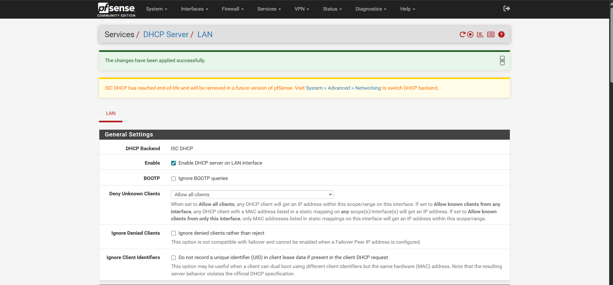

_(Shows green banner "The changes have been applied successfully.")_

### ISC DHCP end-of-life notice

The yellow warning visible in the screenshot states:

> _"ISC DHCP has reached end-of-life and will be removed in a future
> version of pfSense."_

This is an informational notice only — ISC DHCP works fully in
pfSense 2.8.1. Future versions will migrate to **Kea DHCP**. This
kind of real-world detail — knowing that a component is deprecated and
what its replacement is — is valuable knowledge for a network engineer.

---

## Part 7 — Gateway Configuration

### Screenshot 1

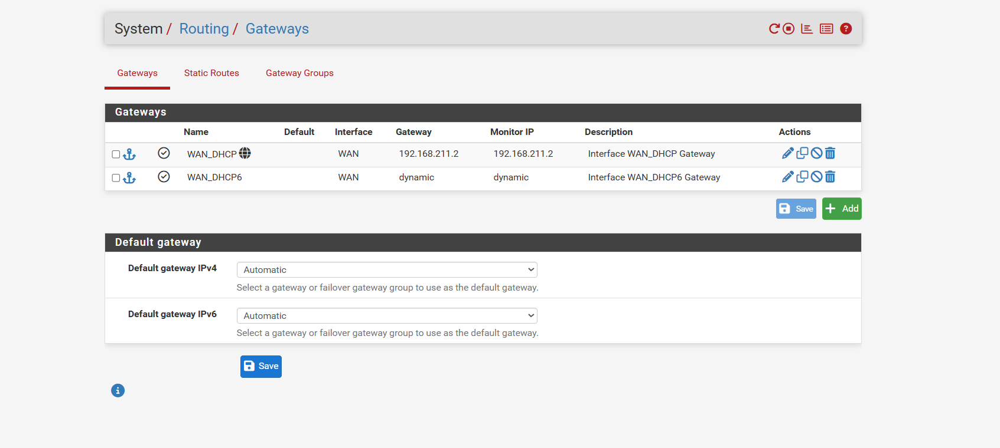

_(Shows gateways table before explicitly setting default)_

### Screenshot 2

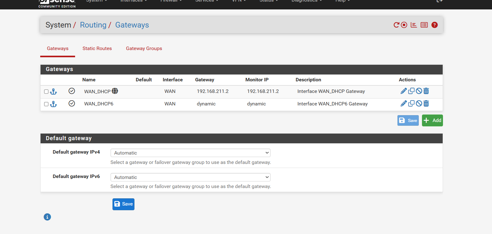

_(Shows same gateways table — both views for reference)_

### Screenshot 3 — Applied

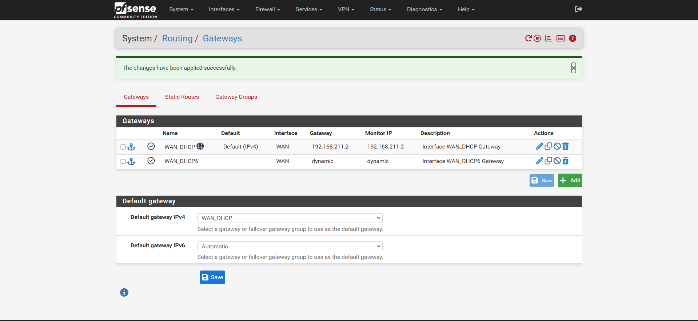

_(Shows gateway saved with WAN_DHCP explicitly set as default IPv4)_

### Navigation path

```
System → Routing → Gateways
```

### Gateways configured

| Name      | Interface | Gateway IP    | Monitor IP    | Description               |
| --------- | --------- | ------------- | ------------- | ------------------------- |
| WAN_DHCP  | WAN       | 192.168.211.2 | 192.168.211.2 | VMware NAT gateway (IPv4) |
| WAN_DHCP6 | WAN       | dynamic       | dynamic       | IPv6 gateway (auto)       |

### What 192.168.211.2 is

This is the **VMware NAT gateway** — the virtual router VMware creates
internally when a VM uses NAT mode. All internet-bound traffic from
pfSense exits via this IP into VMware's NAT engine, which then routes
it out through the Windows host's real network adapter to the internet.

### Why the default gateway was explicitly set

Initially the default gateway was set to **Automatic** — pfSense chose
the gateway on its own. During troubleshooting a routing issue (TTL
expired errors), the gateway was explicitly set to **WAN_DHCP** to
ensure pfSense always routes internet traffic via the correct path.

After this change and saving:

```
Default gateway IPv4: WAN_DHCP (192.168.211.2)
```

The TTL expired errors stopped.

---

## Part 8 — Verifying Internet Connectivity

Two methods were used to confirm pfSense could reach the internet:

### Method 1 — Console ping (Shell — Option 8)

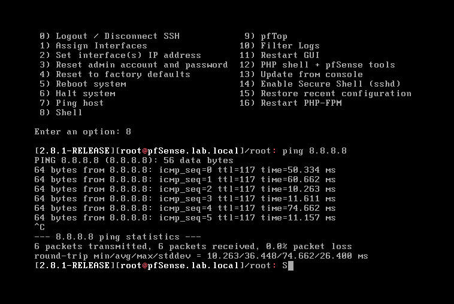

_(Shows ping 8.8.8.8 from pfSense shell — 6 packets, 0% loss)_

From the pfSense console (Option 8 → Shell):

```bash
ping 8.8.8.8
```

Output:

```
PING 8.8.8.8 (8.8.8.8): 56 data bytes
64 bytes from 8.8.8.8: icmp_seq=0 ttl=117 time=50.334 ms
64 bytes from 8.8.8.8: icmp_seq=1 ttl=117 time=60.662 ms
6 packets transmitted, 6 received, 0.0% packet loss
```

TTL=117 confirms the packet is making real hops across the internet
to reach Google — not a local loop. NAT is working correctly.

### Method 2 — Web GUI Diagnostics ping

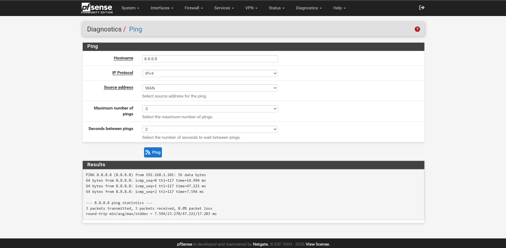

_(Shows Diagnostics → Ping → 8.8.8.8 with 3 successful replies)_

```
Navigation: Diagnostics → Ping
Hostname: 8.8.8.8
IP Protocol: IPv4
Source address: WAN
```

Result:

```
PING 8.8.8.8 from 192.168.1.101: 56 data bytes
3 packets transmitted, 3 received, 0.0% packet loss
```

Source IP shown as `192.168.1.101` — pfSense's WAN IP at this stage.
This confirms NAT is translating LAN traffic to the WAN IP correctly.

---

## Part 9 — DNS Resolver Configuration

pfSense has two DNS services:

| Service                 | What it does                                                    |
| ----------------------- | --------------------------------------------------------------- |
| DNS Forwarder (dnsmasq) | Lightweight forwarder — passes queries upstream                 |
| DNS Resolver (Unbound)  | Full resolver — can cache, enforce, and with pfBlockerNG: block |

**DNS Resolver (Unbound)** was used — required for pfBlockerNG DNSBL
to work. pfBlockerNG hooks directly into Unbound to intercept and
sinkhole blocked domain queries.

### DNS Forwarder settings

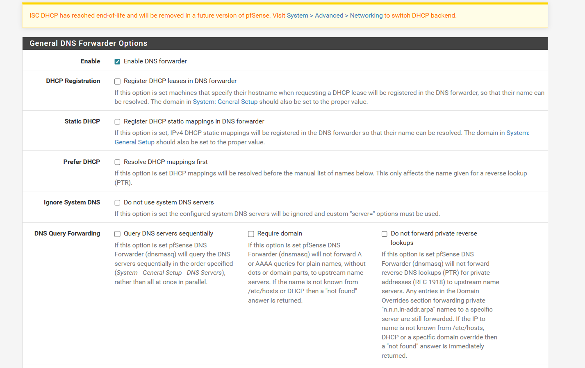

_(Shows DNS Forwarder settings — Enable checked, other options default)_

```
Navigation: Services → DNS Forwarder
```

| Setting              | Value      |
| -------------------- | ---------- |
| Enable DNS Forwarder | ✅ Enabled |
| DHCP Registration    | ☐ Disabled |
| Static DHCP          | ☐ Disabled |
| Ignore System DNS    | ☐ Disabled |

### DNS Resolver — Forwarding Mode

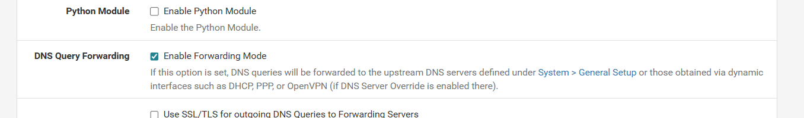

_(Shows DNS Query Forwarding — Enable Forwarding Mode checked)_

```
Navigation: Services → DNS Resolver → General Settings
```

Critical setting enabled:

```
DNS Query Forwarding: ✅ Enable Forwarding Mode
```

**What forwarding mode does:** When a client queries pfSense for
`google.com`, pfSense forwards the query to `8.8.8.8` (defined in
System → General Setup) instead of resolving it from root nameservers
directly. This is faster and more reliable in NAT environments.

**Without forwarding mode:** pfSense would try to query root nameservers
directly — which sometimes fails in double-NAT or home lab environments.

### Domain Override for company.local

```
Navigation: Services → DNS Resolver → General Settings → Domain Overrides
```

| Domain        | IP             | Purpose                                |
| ------------- | -------------- | -------------------------------------- |
| company.local | 192.168.20.101 | Forward .local queries to Ubuntu BIND9 |

This tells pfSense: _"For any query ending in company.local, ask
Ubuntu's BIND9 server at 192.168.20.101 instead of forwarding to 8.8.8.8."_

This is how the internal domain name resolution chain works:

```
Client asks: what is www.company.local?
→ pfSense DNS Resolver checks: is this company.local? Yes.
→ Forwards to 192.168.20.101 (BIND9 on Ubuntu)
→ BIND9 answers: 192.168.20.101
→ pfSense returns answer to client
→ Client connects to Apache on Ubuntu ✅
```

---

## Part 10 — Troubleshooting Console Sessions

Two troubleshooting sessions were conducted directly on the pfSense
console (not via web GUI) to fix routing issues during setup.

### Console Session 1 — Routing restart

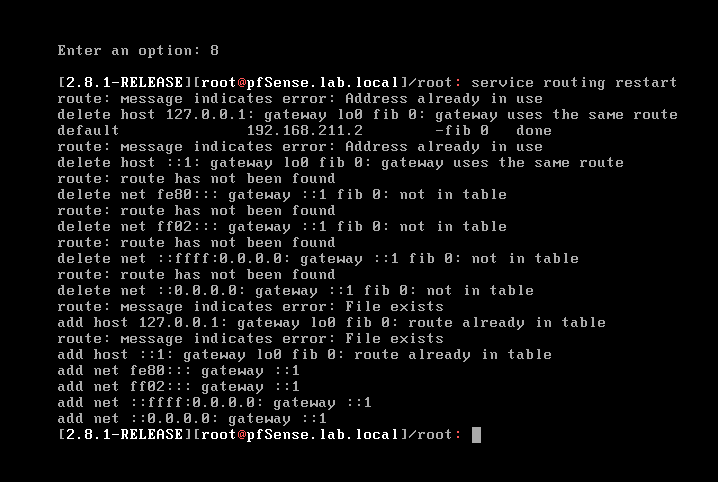

_(Shows service routing restart output with route table messages)_

**Problem:** Internet traffic was not routing correctly after initial setup.

**Action taken:** From console Option 8 (Shell):

```bash
service routing restart
```

**Output seen:**

```
route: message indicates error: Address already in use
delete host 127.0.0.1: gateway lo0 fib 0: gateway uses the same route
default    192.168.211.2    -fib 0    done
```

**What each line means:**

| Message                       | Meaning                           | Problem?        |
| ----------------------------- | --------------------------------- | --------------- |
| `Address already in use`      | Route entry exists before restart | No — expected   |
| `gateway uses the same route` | Loopback already registered       | No — expected   |
| `default 192.168.211.2 done`  | Default route set successfully    | ✅ Success      |
| `route has not been found`    | IPv6 routes not populated         | Minor — no IPv6 |

The key line is `default 192.168.211.2 done` — confirming the default
route to the WAN gateway was set successfully.

### Console Session 2 — PF service restart error

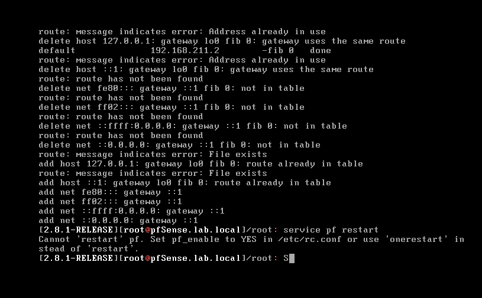

_(Shows service pf restart error and the workaround)_

**Action attempted:**

```bash
service pf restart
```

**Error received:**

```
Cannot 'restart' pf. Set pf_enable to YES in /etc/rc.conf
or use 'onerestart' instead.
```

**What this means:** In FreeBSD (which pfSense is based on), the `pf`
packet filter cannot be restarted with the standard `restart` command.
FreeBSD's rc system requires `onerestart` for live services, or the
service must be controlled through the web GUI.

**Fix applied:** Used the pfSense web GUI → Firewall → Rules →
Apply Changes button instead. This correctly reloads pf internally
without the rc system conflict.

**Learning:** This is a FreeBSD-specific behaviour that differs from
Linux. On Linux, `service iptables restart` works fine. On FreeBSD,
the rc service management is stricter. Knowing this difference
demonstrates real cross-platform system administration experience.

---

## Part 11 — Final pfSense Status

After completing all configuration steps, pfSense was fully operational:

| Component       | Status                        | Verified By             |
| --------------- | ----------------------------- | ----------------------- |
| WAN interface   | ✅ Up — 192.168.211.134       | Dashboard green arrow   |
| LAN interface   | ✅ Up — 192.168.20.1          | Dashboard green arrow   |
| Internet access | ✅ Working                    | Ping 8.8.8.8 — 0% loss  |
| DHCP server     | ✅ Serving 192.168.20.100–199 | Client gets IP          |
| DNS resolver    | ✅ Forwarding mode enabled    | nslookup works          |
| company.local   | ✅ Domain override active     | Browser resolves domain |
| Gateway         | ✅ WAN_DHCP explicitly set    | Routing stable          |
| Admin password  | ✅ Changed from default       | Security warning gone   |

---

## What This Demonstrates

Deploying and configuring pfSense covers skills directly relevant to
network engineering roles:

- Firewall installation on virtualized hardware (VMware)
- Interface assignment and IP addressing on a dual-homed firewall
- DHCP server configuration with controlled IP pools
- DNS resolver configuration with forwarding and domain overrides
- Gateway management and static route verification
- Console-based troubleshooting on FreeBSD systems
- Reading and interpreting system routing tables
- Understanding the difference between DNS forwarding and resolution

These skills apply directly to enterprise firewalls including Cisco ASA,
Fortinet FortiGate, Juniper SRX, and Palo Alto — all of which share the
same core concepts of interface roles, NAT, and stateful firewall rules.

---

_Document: 03-PFSENSE-SETUP.md_
_Project: Mini Enterprise Network_
_Author: Mayur Garje_
_Date: May 2026_
