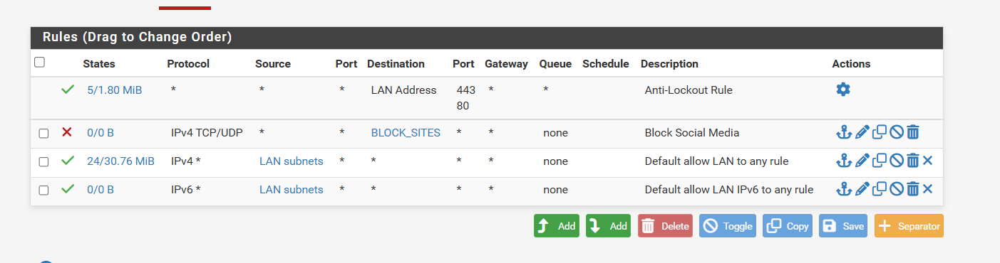
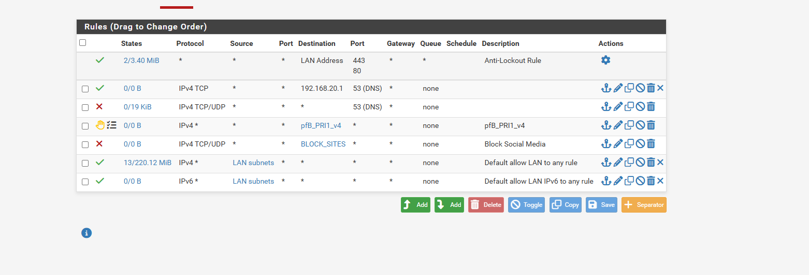
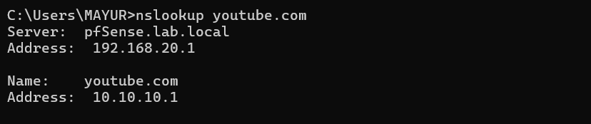

# 🛡️ pfSense Firewall Rules

### Mini Enterprise Network — Mayur Garje

---

## Overview

Firewall rules are the heart of network security. Every packet that
enters or leaves the LAN is evaluated against these rules — top to
bottom — and either allowed or blocked based on the first matching rule.

In this project, the firewall rules serve three purposes:

1. **Access control** — decide what traffic is allowed on the network
2. **DNS enforcement** — force all clients to use pfSense DNS only
3. **Content filtering support** — work alongside pfBlockerNG to block domains

---

## How pfSense Firewall Rules Work

### Rule evaluation order

pfSense evaluates rules **top to bottom**. The first rule that matches
a packet wins — no further rules are checked. This means rule order
is critical.

```
Packet arrives on LAN interface
        ↓
Rule 1: Does it match? → YES → Apply rule → STOP
        ↓ NO
Rule 2: Does it match? → YES → Apply rule → STOP
        ↓ NO
Rule 3: Does it match? → YES → Apply rule → STOP
        ↓ NO
(implicit) Default deny → packet dropped
```

### Rule directions

pfSense rules on the LAN interface are evaluated on **inbound** traffic —
traffic coming FROM the LAN INTO the firewall. This is the standard
pfSense model and differs from how some other firewalls work.

### Rule components

Each rule has:

| Component        | Meaning                              |
| ---------------- | ------------------------------------ |
| Action           | Pass (allow) or Block (deny)         |
| Protocol         | TCP, UDP, TCP/UDP, ICMP, or any (\*) |
| Source           | Where traffic originates             |
| Source Port      | Port traffic comes from              |
| Destination      | Where traffic is going               |
| Destination Port | Port traffic is going to             |
| Description      | Human-readable label                 |

---

## Rule Set — Initial State (After Wizard)

After the pfSense setup wizard completed, two default rules existed:



_(Shows firewall rules before DNS enforcement — 4 rules visible)_

| #   | Status | Protocol     | Source      | Destination | Port    | Description                   |
| --- | ------ | ------------ | ----------- | ----------- | ------- | ----------------------------- |
| 1   | ✅     | Any          | Any         | LAN Address | 443, 80 | Anti-Lockout Rule             |
| 2   | ❌     | IPv4 TCP/UDP | Any         | BLOCK_SITES | Any     | Block Social Media            |
| 3   | ✅     | IPv4 \*      | LAN subnets | Any         | Any     | Default allow LAN to any      |
| 4   | ✅     | IPv6 \*      | LAN subnets | Any         | Any     | Default allow LAN IPv6 to any |

---

## Rule Set — Final State (After Full Configuration)



\*(Shows complete final firewall rules — 7 rules including DNS enforcement

> pair and pfBlockerNG auto-rule)\*

| #   | Status      | Protocol     | Source      | Destination  | Port         | Description                   |
| --- | ----------- | ------------ | ----------- | ------------ | ------------ | ----------------------------- |
| 1   | ✅ Active   | Any          | Any         | LAN Address  | 443, 80      | Anti-Lockout Rule             |
| 2   | ✅ Active   | IPv4 TCP     | Any         | 192.168.20.1 | **53 (DNS)** | Allow DNS to pfSense          |
| 3   | ❌ Disabled | IPv4 TCP/UDP | Any         | Any          | **53 (DNS)** | Block all external DNS        |
| 4   | 🔶 pfB Auto | IPv4 \*      | Any         | pfB_PRI1_v4  | Any          | pfBlockerNG IP block          |
| 5   | ❌ Disabled | IPv4 TCP/UDP | Any         | BLOCK_SITES  | Any          | Block Social Media            |
| 6   | ✅ Active   | IPv4 \*      | LAN subnets | Any          | Any          | Default allow LAN to any      |
| 7   | ✅ Active   | IPv6 \*      | LAN subnets | Any          | Any          | Default allow LAN IPv6 to any |

---

## Rule-by-Rule Deep Dive

---

### Rule 1 — Anti-Lockout Rule

```
Action:      PASS
Protocol:    Any
Source:      Any
Destination: LAN Address (192.168.20.1)
Ports:       80 (HTTP), 443 (HTTPS)
Description: Anti-Lockout Rule
Type:        Built-in — cannot be deleted
```

#### What it does

Guarantees that the pfSense web GUI at `192.168.20.1` is always
reachable from the LAN — even if all other rules are misconfigured
or accidentally block everything.

#### Why it exists

Imagine accidentally writing a rule that blocks all traffic. Without
this rule, you would be locked out of the web GUI with no way to fix
the mistake except a factory reset. The Anti-Lockout Rule is pfSense's
safety net — it is processed before all other rules and cannot be
removed.

#### What the gear icon (⚙️) means

The Actions column shows only a settings gear — no edit/delete icons.
This confirms the rule is built-in and protected.

#### States counter

The rule shows `5/1.80 MiB` meaning 5 active connections totalling
1.80 MiB of traffic have passed through — this is web GUI traffic
from the Windows host managing pfSense.

---

### Rule 2 — Allow DNS to pfSense (DNS Enforcement Part 1)

```
Action:      PASS
Protocol:    IPv4 TCP
Source:      Any (LAN clients)
Destination: 192.168.20.1 (pfSense LAN IP)
Port:        53 (DNS)
Description: (blank — identified by destination IP and port)
```

#### What it does

Explicitly allows all LAN clients to send DNS queries to pfSense
itself on port 53. This is the **first half** of the DNS enforcement
pair.

#### Why this rule is needed

When Rule 3 (block all DNS) is enabled, it would also block DNS to
pfSense itself if Rule 2 did not come first. Since rules are evaluated
top to bottom, Rule 2 catches traffic destined for pfSense DNS and
allows it — before Rule 3 can block it.

```
Client sends DNS query to 192.168.20.1:53
→ Rule 1: destination is LAN address port 80/443? No
→ Rule 2: destination is 192.168.20.1 port 53? YES → ALLOW ✅
(Rule 3 never reached for this traffic)
```

#### What happens without this rule

If Rule 3 (block DNS) was added without Rule 2 first, ALL DNS
traffic would be blocked — including queries to pfSense. Clients
would lose all DNS resolution and the internet would appear broken.
This was discovered during testing.

---

### Rule 3 — Block All External DNS (DNS Enforcement Part 2)

```
Action:      BLOCK
Protocol:    IPv4 TCP/UDP
Source:      Any
Destination: Any
Port:        53 (DNS)
Description: (blank — identified by port)
Status:      ❌ Disabled in screenshot (was enabled during enforcement)
```

#### What it does

Blocks any DNS query going to **any destination** on port 53 —
except those already allowed by Rule 2.

Since Rule 2 comes first and allows DNS to pfSense, this rule
effectively blocks DNS to everything else — 8.8.8.8, 1.1.1.1,
any custom DNS server a user might configure.

#### The bypass attempt scenario — step by step

```
Scenario: User knows YouTube is blocked and tries to bypass it

Step 1: User opens Windows network settings
Step 2: Changes DNS server from 192.168.20.1 to 8.8.8.8
Step 3: Opens browser → types youtube.com
Step 4: Windows sends DNS query to 8.8.8.8:53

Without Rule 3:
→ Query reaches 8.8.8.8
→ Real YouTube IP returned
→ YouTube loads → bypass successful ❌

With Rule 3 enabled:
→ Query to 8.8.8.8:53 hits Rule 3
→ Packet BLOCKED by firewall
→ Query never reaches 8.8.8.8
→ Client times out on DNS
→ Falls back to pfSense DNS
→ pfBlockerNG returns 10.10.10.1
→ YouTube blocked regardless ✅
```

#### Why both TCP and UDP are blocked

DNS uses **UDP port 53** for standard queries (fast, small packets).
DNS uses **TCP port 53** for large responses and zone transfers.
Blocking only UDP would leave a bypass path through TCP — so
both protocols are blocked.

#### Why Rule 3 shows as disabled in the screenshot

During testing, Rule 3 was toggled on and off to verify the
enforcement behaviour at each stage. The screenshot captures
a moment when it was temporarily disabled for verification.
In the enforced state it is enabled.

---

### Rule 4 — pfBlockerNG Auto-Rule (pfB_PRI1_v4)

```
Action:      BLOCK
Protocol:    IPv4 *
Source:      Any
Destination: pfB_PRI1_v4 (alias — list of blocked IPs)
Port:        Any
Description: pfB_PRI1_v4
Type:        Floating rule — auto-created by pfBlockerNG
Icon:        🔶 (floating rule indicator)
```

#### What it does

Blocks traffic to any IP address in the pfBlockerNG IP block list
alias `pfB_PRI1_v4`. This is the IP-based blocking component of
pfBlockerNG — separate from the DNS-based DNSBL blocking.

#### What pfB_PRI1_v4 is

`pfB_PRI1_v4` is a **firewall alias** — a named list that can contain
thousands of IP addresses or IP ranges. pfBlockerNG automatically
populates this alias from the IP block feeds configured in its
settings (GeoIP lists, threat intelligence feeds, etc.).

Instead of creating thousands of individual firewall rules, pfSense
uses one alias rule that references the entire list — much more
efficient.

#### What the 🔶 floating rule icon means

This is a **floating rule** — it applies across all interfaces, not
just LAN. Floating rules are evaluated before interface-specific
rules. pfBlockerNG creates floating rules so its IP blocking applies
to all traffic regardless of which interface it enters on.

#### Who manages this rule

This rule is **entirely managed by pfBlockerNG**. It should never
be manually edited — pfBlockerNG updates, adds, and removes entries
in the alias automatically based on configured feeds and schedules.

---

### Rule 5 — Block Social Media (BLOCK_SITES Alias)

```
Action:      BLOCK
Protocol:    IPv4 TCP/UDP
Source:      Any
Destination: BLOCK_SITES (alias)
Port:        Any
Description: Block Social Media
Status:      ❌ Disabled
```

#### What it does

Blocks traffic to any IP address in the `BLOCK_SITES` alias —
a manually created alias intended to contain IP addresses of
social media platforms.

#### Why it was created

This was the initial approach to content blocking before pfBlockerNG
was installed. The idea was to add YouTube, Instagram, and other
social media IP addresses to the alias and block them at the
firewall level.

#### Why it was replaced by pfBlockerNG

IP-based blocking has a fundamental weakness for large platforms:

```
YouTube uses:
- 172.217.x.x (Google servers)
- 142.250.x.x (Google servers)
- 2607:f8b0::/32 (IPv6)
- Thousands of CDN edge IPs that change constantly
```

Maintaining a manual IP list for YouTube would require constant
updates as Google rotates IPs. pfBlockerNG's DNSBL approach is
superior because it blocks the **domain name** — no matter what
IP YouTube uses, the domain always resolves to the sinkhole.

The rule was disabled (not deleted) to preserve the configuration
history and the `BLOCK_SITES` alias for future reference.

---

### Rule 6 — Default Allow LAN to Any

```
Action:      PASS
Protocol:    IPv4 *
Source:      LAN subnets
Destination: Any
Port:        Any
Description: Default allow LAN to any rule
```

#### What it does

Allows all IPv4 traffic from any LAN device to any destination.
This is the rule that gives LAN clients internet access —
without it, nothing would work.

#### Why it comes after the block rules

Rule order matters critically here:

```
Traffic flow through the rule set:

DNS to 8.8.8.8:53
→ Rule 2: Not matching (destination is not pfSense) → skip
→ Rule 3: Matches (destination any, port 53) → BLOCK ✅

HTTP to google.com:80
→ Rule 2: Not matching → skip
→ Rule 3: Not matching (port 80, not 53) → skip
→ Rule 4: Not matching (google.com not in pfB_PRI1_v4) → skip
→ Rule 5: Not matching (disabled) → skip
→ Rule 6: Matches (LAN subnet, any destination) → ALLOW ✅
```

By placing specific block rules (Rules 2–5) before this catch-all
allow rule, specific traffic is blocked while everything else flows
normally.

#### States counter

`13/220.12 MiB` — 13 active connections with 220MB of traffic.
This is the main traffic rule — all normal internet browsing, file
downloads, and application traffic passes through here.

---

### Rule 7 — Default Allow LAN IPv6 to Any

```
Action:      PASS
Protocol:    IPv6 *
Source:      LAN subnets
Destination: Any
Port:        Any
Description: Default allow LAN IPv6 to any rule
```

Same as Rule 6 but for IPv6 traffic. pfSense creates this
automatically. Since IPv6 was not specifically configured in this
lab, this rule sees minimal traffic.

---

## The DNS Enforcement Architecture

The combination of Rules 2 and 3 creates a DNS enforcement system
that makes content filtering unbypassable. This is worth understanding
in full detail.

### Architecture diagram

```
                    LAN CLIENT (192.168.20.103)
                           |
                    DNS query: youtube.com
                           |
              ┌────────────┴────────────┐
              │                         │
    Query to pfSense             Query to 8.8.8.8
    192.168.20.1:53              8.8.8.8:53
              │                         │
              ▼                         ▼
    Rule 2: ALLOW ✅           Rule 3: BLOCK ❌
              │                         │
              ▼                    Packet dropped
    pfSense DNS Resolver         Client cannot bypass
              │
              ▼
    pfBlockerNG intercepts
              │
              ▼
    Returns: 10.10.10.1
    (sinkhole — not real YouTube)
              │
              ▼
    Browser tries 10.10.10.1
    Nothing there → fails
              │
              ▼
    YouTube inaccessible ✅
```

### Why this is industry-standard

This exact pattern — allowing internal DNS, blocking external DNS —
is used in:

- Corporate networks to enforce acceptable use policies
- School networks to enforce content filtering
- ISP networks for parental control services
- Government networks for compliance

The only difference in enterprise environments is scale — the same
two rules, applied across thousands of devices.

---

## BLOCK_SITES Alias — How It Was Created

```
Navigation: Firewall → Aliases → Add
```

| Field       | Value                          |
| ----------- | ------------------------------ |
| Name        | BLOCK_SITES                    |
| Description | Social media and blocked sites |
| Type        | Host(s) or Network(s)          |

IP addresses of sites to block would be added here. For YouTube,
this approach was abandoned in favour of pfBlockerNG DNSBL.

The alias is still visible in the firewall rules as the destination
of the disabled Rule 5.

---

## Firewall Rule Best Practices Applied

### 1. Most specific rules first

Block rules for specific ports (DNS port 53) appear before the
broad allow-all rule. If the order were reversed, the allow-all
would match first and the block rules would never be reached.

### 2. Anti-lockout protection

Rule 1 (Anti-Lockout) is always first. Never placing any block
rule above it ensures the web GUI remains accessible for management.

### 3. Disable rather than delete

Rules 3 and 5 were disabled rather than deleted during testing.
This preserves the configuration for future re-enabling and also
maintains a record of what was tried. In production this is standard
practice during change management.

### 4. Aliases over individual rules

Using the `BLOCK_SITES` alias and `pfB_PRI1_v4` alias means one
rule covers hundreds or thousands of IPs. Creating individual rules
for each IP would be unmanageable and degrade firewall performance.

### 5. Descriptions on every rule

Each manually created rule has a description. In production
environments this is essential — when reviewing rules months later,
descriptions explain why a rule exists. Rules without descriptions
are a common audit finding in enterprise security reviews.

---

## Verification — DNS Enforcement Working

After enabling Rule 2 and Rule 3, the DNS enforcement was verified:

### Test 1 — Normal DNS still works

```
C:\Users\MAYUR> nslookup google.com
Server:   pfSense.lab.local
Address:  192.168.20.1

Name:    google.com
Address: 142.250.70.110
```

✅ Google resolves — pfSense DNS is working normally.

### Test 2 — YouTube is blocked

```
C:\Users\MAYUR> nslookup youtube.com
Server:   pfSense.lab.local
Address:  192.168.20.1

Name:    youtube.com
Address: 10.10.10.1
```



_(Shows nslookup youtube.com returning 10.10.10.1 — the sinkhole IP)_

✅ YouTube returns sinkhole IP — pfBlockerNG DNSBL is intercepting.

### Test 3 — External DNS is blocked

```
C:\Users\MAYUR> nslookup youtube.com 8.8.8.8
;; connection timed out; no servers could be reached
```

✅ Query to 8.8.8.8 timed out — Rule 3 is blocking port 53 to
external servers. DNS bypass is impossible.

---

## Summary — What the Firewall Rules Achieve

| Goal                         | Rules Used        | Result                           |
| ---------------------------- | ----------------- | -------------------------------- |
| Web GUI always accessible    | Rule 1            | ✅ Cannot be locked out          |
| DNS forced through pfSense   | Rules 2 + 3       | ✅ No bypass possible            |
| IP-based blocking active     | Rule 4 (pfB auto) | ✅ pfBlockerNG IP lists enforced |
| Domain-based blocking active | pfBlockerNG DNSBL | ✅ YouTube sinkholed             |
| Normal internet access       | Rule 6            | ✅ All other traffic allowed     |
| Legacy block rule preserved  | Rule 5 (disabled) | ✅ Available for future use      |

---

## What This Demonstrates

Configuring firewall rules at this level demonstrates:

- Understanding of stateful firewall rule evaluation order
- DNS enforcement using allow-before-block rule pairs
- Difference between IP-based and DNS-based content filtering
- Use of firewall aliases for scalable rule management
- Floating rules and how pfBlockerNG integrates with pfSense
- Practical troubleshooting — understanding what breaks when
  rules are in the wrong order
- Real-world security patterns used in enterprise and ISP networks

These concepts apply directly to any enterprise firewall platform —
Cisco ASA access control lists, Fortinet FortiGate policies,
Palo Alto security policies, and Juniper SRX filters all operate
on the same fundamental principle of ordered rule evaluation.

---

_Document: 04-PFSENSE-FIREWALL-RULES.md_
_Project: Mini Enterprise Network_
_Author: Mayur Garje_
_Date: May 2026_
