# 🚫 pfBlockerNG Setup & Content Filtering

### Mini Enterprise Network — Mayur Garje

---

## Overview

pfBlockerNG is a pfSense package that adds two powerful capabilities
to the firewall:

| Capability  | How it works                                   | Used in this project           |
| ----------- | ---------------------------------------------- | ------------------------------ |
| IP Blocking | Blocks traffic to known malicious IP addresses | ✅ Yes — pfB_PRI1_v4 auto-rule |
| DNSBL       | Intercepts DNS queries for blocked domains     | ✅ Yes — YouTube + ads blocked |

In this project pfBlockerNG is used primarily for **DNSBL
(DNS Block List)** — blocking specific domains at the DNS level
before any network connection is even attempted.

### Why DNSBL is more powerful than firewall IP blocking

```
IP blocking approach:
Browser → DNS resolves youtube.com → gets real IP
→ Browser connects to IP → firewall blocks the IP
→ Multiple round trips wasted before block happens
→ YouTube rotates IPs constantly → list breaks

DNSBL approach:
Browser → DNS query for youtube.com
→ pfBlockerNG intercepts query
→ Returns fake IP (10.10.10.1) immediately
→ Browser tries fake IP → no connection possible
→ YouTube never contacted → always blocked
→ Works regardless of what IP YouTube uses
```

DNSBL wins because it stops the connection at the earliest possible
point — the domain name lookup — before any traffic reaches YouTube.

---

## Part 1 — Installation

### Navigation path

```
System → Package Manager → Available Packages
```

### Search and install

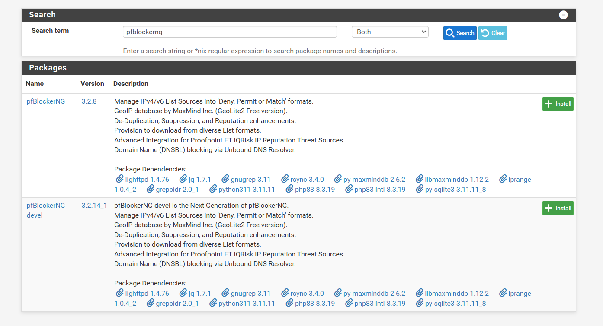

_(Shows Package Manager search results for "pfblockerng")_

In the search box type: `pfblockerng`

Two versions appear:

| Package           | Version  | Description                             |
| ----------------- | -------- | --------------------------------------- |
| **pfBlockerNG**   | 3.2.8    | Stable release — **this was installed** |
| pfBlockerNG-devel | 3.2.14_1 | Development/beta version                |

Click **Install** next to pfBlockerNG (stable).

### What gets installed with pfBlockerNG

pfBlockerNG has many dependencies that install automatically:

```
lighttpd-1.4.76      — lightweight web server for block page
jq-1.7.1             — JSON processor for feed parsing
gnugrep-3.11         — pattern matching for list processing
rsync-3.4.0          — file sync for list downloads
py-maxminddb-2.6.2   — MaxMind GeoIP database reader
libmaxminddb-1.12.2  — MaxMind library
grepcidr-2.0_1       — CIDR range matching
python311-3.11.11    — Python runtime
php83-8.3.19         — PHP for web interface
iprange-1.0.4_2      — IP range tools
py-sqlite3-3.11.11_8 — SQLite for pfBlockerNG database
```

This is a substantial package with real infrastructure — not a simple
plugin. This explains why pfBlockerNG is so capable.

---

## Part 2 — pfBlockerNG Setup Wizard

After installation, pfBlockerNG launches its own setup wizard.

### Wizard Welcome Screen

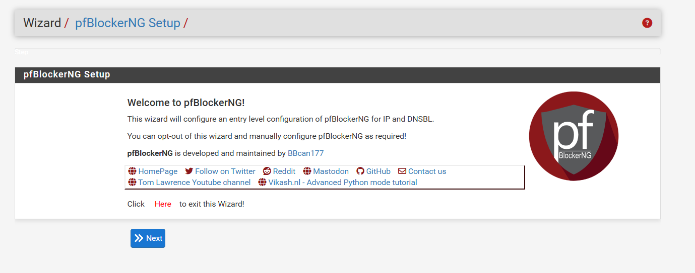

_(Shows pfBlockerNG Setup Wizard welcome screen)_

```
Wizard / pfBlockerNG Setup
```

The wizard configures an entry-level IP and DNSBL configuration.
It can be skipped for manual configuration — but the wizard was
used here to set up the foundation correctly.

---

### Wizard Step 2 — IP Component Configuration

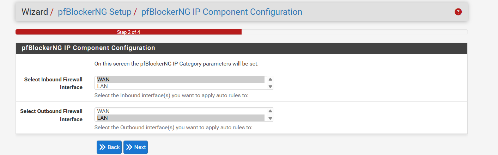

_(Shows Step 2 of 4 — inbound and outbound interface selection)_

```
Wizard / pfBlockerNG Setup / pfBlockerNG IP Component Configuration
Step 2 of 4
```

| Setting                     | Value selected | Purpose                               |
| --------------------------- | -------------- | ------------------------------------- |
| Inbound Firewall Interface  | WAN + LAN      | Apply IP block rules inbound on both  |
| Outbound Firewall Interface | WAN + LAN      | Apply IP block rules outbound on both |

#### Why both WAN and LAN are selected

**WAN inbound:** Blocks known malicious IPs from the internet
reaching internal devices — stops attack traffic before it enters.

**LAN inbound/outbound:** Blocks LAN clients from initiating
connections to known malicious IPs — stops infected devices from
calling home to command-and-control servers.

Selecting both provides **bidirectional protection** — neither
inbound attacks nor outbound malware communication can bypass
the IP block lists.

#### What pfBlockerNG auto-creates from this

After completing the wizard, pfBlockerNG automatically creates
floating firewall rules for both interface directions. These
appear as Rule 4 (`pfB_PRI1_v4`) in the LAN firewall rules
and do not need manual management.

---

### Wizard Step 3 — DNSBL Component Configuration

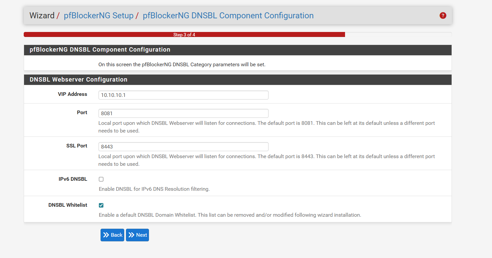

_(Shows Step 3 of 4 — DNSBL webserver and sinkhole IP configuration)_

```
Wizard / pfBlockerNG Setup / pfBlockerNG DNSBL Component Configuration
Step 3 of 4
```

This is the most important wizard step — configuring the DNS
sinkhole that blocked domains will resolve to.

#### Configuration set

| Setting         | Value        | Explanation                                         |
| --------------- | ------------ | --------------------------------------------------- |
| VIP Address     | `10.10.10.1` | Sinkhole IP — blocked domains resolve here          |
| Port            | `8081`       | pfBlockerNG internal web server (HTTP)              |
| SSL Port        | `8443`       | pfBlockerNG internal web server (HTTPS)             |
| IPv6 DNSBL      | ☐ Disabled   | IPv4-only lab — no IPv6 blocking needed             |
| DNSBL Whitelist | ✅ Enabled   | Protects essential domains from accidental blocking |

#### What the sinkhole IP 10.10.10.1 does

When any blocked domain is queried (e.g. youtube.com), pfBlockerNG
returns `10.10.10.1` as the answer instead of the real IP.

The client then tries to connect to `10.10.10.1` — which is
pfBlockerNG's internal lighttpd web server. This server returns
a **block page** (dnsbl_default.php) explaining the site is blocked.

```
Normal resolution:
youtube.com → DNS → 142.250.x.x (real YouTube IP) → connects

Blocked resolution:
youtube.com → DNS → 10.10.10.1 (sinkhole) → block page shown
```

#### Why 10.10.10.1 was chosen

`10.10.10.1` is:

- **RFC1918 compliant** — a private IP range (10.0.0.0/8)
- **Not used anywhere in this network** — no real device has this IP
- **Not routable on the internet** — cannot accidentally reach a real server
- **The pfBlockerNG default** — recommended in documentation

---

### Wizard Step 4 — Finish

Wizard completes. pfBlockerNG is now installed with basic
configuration. The initial run automatically downloads and loads
the default DNSBL feeds.

---

## Part 3 — DNSBL Full Configuration

After the wizard, detailed DNSBL settings were configured
in the pfBlockerNG DNSBL settings page.

### Navigation path

```
Firewall → pfBlockerNG → DNSBL
```

---

### DNSBL Main Settings

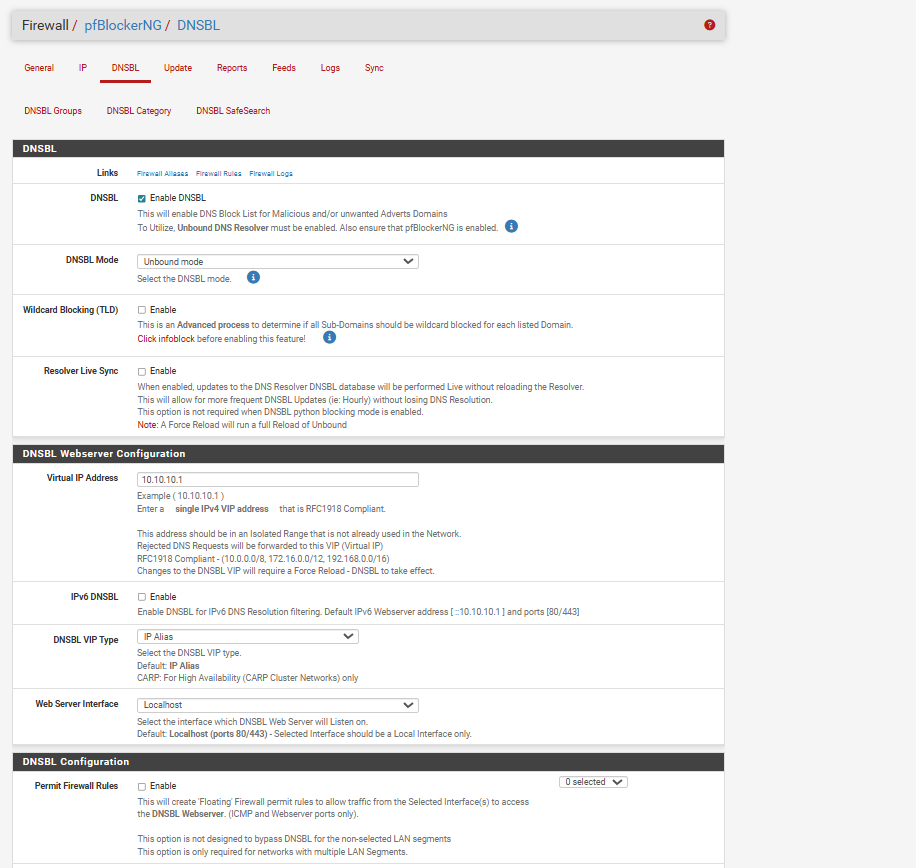

_(Shows DNSBL section — Enable DNSBL checked, Unbound mode selected)_

#### DNSBL section

| Setting                 | Value            | Meaning                                  |
| ----------------------- | ---------------- | ---------------------------------------- |
| Enable DNSBL            | ✅ Enabled       | DNSBL is active and intercepting queries |
| DNSBL Mode              | **Unbound mode** | Uses pfSense Unbound DNS resolver        |
| Wildcard Blocking (TLD) | ☐ Disabled       | Not blocking entire TLDs                 |
| Resolver Live Sync      | ☐ Disabled       | Full reload used instead of live sync    |

#### Why Unbound mode

pfBlockerNG has two DNSBL modes:

| Mode         | How it works                    | When to use                            |
| ------------ | ------------------------------- | -------------------------------------- |
| Unbound mode | Hooks into Unbound DNS resolver | When using DNS Resolver (this project) |
| dnsmasq mode | Hooks into dnsmasq forwarder    | When using DNS Forwarder               |

Since pfSense's DNS Resolver (Unbound) was enabled and forwarding
mode was activated, **Unbound mode** is the correct choice.
pfBlockerNG inserts itself directly into Unbound's processing pipeline —
domain interception happens before the query is forwarded anywhere.

#### DNSBL Webserver Configuration

| Setting              | Value                   |
| -------------------- | ----------------------- |
| Virtual IP Address   | `10.10.10.1` (sinkhole) |
| IPv6 DNSBL           | ☐ Disabled              |
| DNSBL VIP Type       | IP Alias                |
| Web Server Interface | Localhost               |

---

### DNSBL Additional Settings

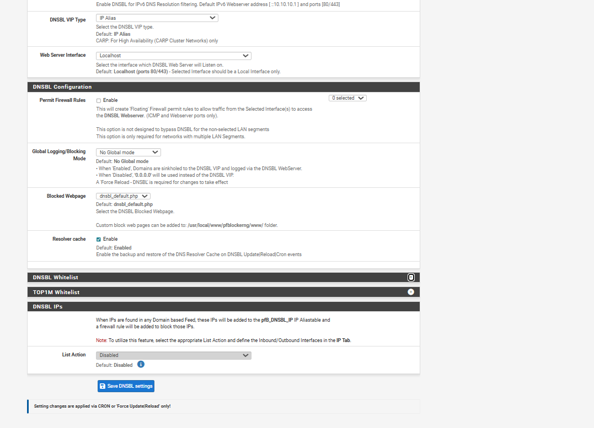

\*(Shows DNSBL Configuration section — logging mode, blocked page,

> resolver cache, whitelist sections)\*

| Setting                      | Value                 | Meaning                             |
| ---------------------------- | --------------------- | ----------------------------------- |
| Permit Firewall Rules        | ☐ Disabled            | Not needed for single-LAN setup     |
| Global Logging/Blocking Mode | No Global mode        | Each group controls its own logging |
| Blocked Webpage              | dnsbl_default.php     | Default block page shown to clients |
| Resolver cache               | ✅ Enabled            | DNS cache backed up on updates      |
| DNSBL IPs                    | List Action: Disabled | IP-based DNSBL not used             |

#### The important notice at the bottom

```
Setting changes are applied via CRON or 'Force Update/Reload' only!
```

This was a source of confusion early in setup. Adding a domain
to the block list does not take effect immediately. Changes require
either:

- Waiting for the scheduled CRON job to run
- Manually running **Force Update → Reload** from the Update tab

Every time YouTube domains were added to Custom_List, a Force
Reload was needed before the block became active.

---

## Part 4 — First Update Run

### Screenshot

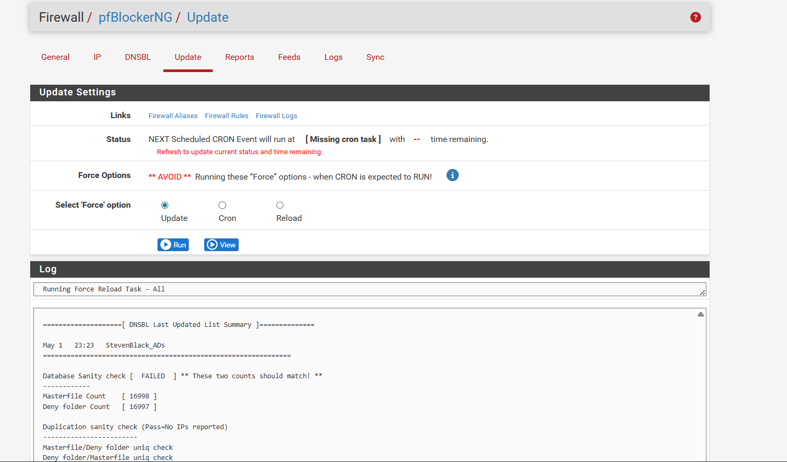

> _(Shows Update tab with Force Update running and DNSBL log output)_

### Navigation path

```
Firewall → pfBlockerNG → Update
```

### First force update — what happened

After completing wizard setup, a **Force Update** was run to
immediately load all configured block lists without waiting
for the CRON schedule.

#### Log output visible

```
Running Force Reload Task - All
======[ DNSBL Last Updated List Summary ]========

May 1  23:23  StevenBlack_ADs
Database Sanity check [ FAILED ]
Masterfile Count  [ 16998 ]
Deny folder Count [ 16997 ]
Duplication sanity check (Pass=No IPs reported)
```

#### What StevenBlack_ADs is

The `StevenBlack_ADs` feed is a widely-used, community-maintained
domain block list that combines multiple ad-blocking and malware
lists. It loaded **16,998 domains** into pfBlockerNG on the first run.

Domains blocked by StevenBlack include:

- Advertising networks (Google Ads, DoubleClick)
- Tracking and analytics beacons
- Known malware distribution domains
- Cryptomining domains

This is the same list that later blocked the advertising beacons
visible in the pfBlockerNG Reports alerts.

#### What "Database Sanity check FAILED" means

```
Masterfile Count  [ 16998 ]
Deny folder Count [ 16997 ]
Difference: 1 entry
```

A difference of exactly 1 entry between the masterfile and deny
folder is a **harmless first-run anomaly**. It occurs because the
database is being built for the first time and one file write
completes slightly after the count is taken. It resolved on the
next update run. This is documented in pfBlockerNG community forums
as a known first-run behaviour.

---

## Part 5 — Force Reload Configuration

### Screenshot

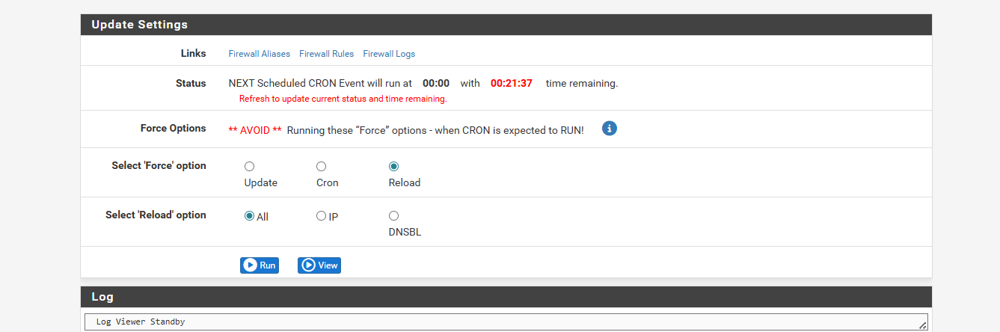

_(Shows Update tab with Reload selected and All option — CRON countdown visible)_

After adding YouTube domains to Custom_List, a Force Reload
was run to apply the changes immediately.

### Update tab options explained

| Option     | What it does                                                 |
| ---------- | ------------------------------------------------------------ |
| **Update** | Downloads fresh block list files from configured URLs        |
| **Cron**   | Runs scheduled maintenance tasks                             |
| **Reload** | Reloads existing lists into Unbound — applies manual changes |

### Configuration used

```
Select Force option: ● Reload
Select Reload option: ● All
→ Click Run
```

**Reload → All** was chosen because:

- YouTube domains were entered in Custom_List (no URL to download)
- Only a reload of existing data was needed — not a fresh download
- "All" reloads both IP lists and DNSBL lists simultaneously

### CRON status visible

```
NEXT Scheduled CRON Event will run at 00:00 with 00:21:37 time remaining
```

This shows pfBlockerNG has a scheduled midnight update. The Force
Reload bypasses this wait — changes take effect in seconds instead
of up to 21 minutes.

---

## Part 6 — DNSBL Groups

### Screenshot


_(Shows DNSBL Groups Summary with ADs_Basic and YOUTUBE_BLOCK)_

### Navigation path

```
Firewall → pfBlockerNG → DNSBL → DNSBL Groups
```

### Groups configured

| Group Name    | Action      | Frequency  | Blocking Mode       |
| ------------- | ----------- | ---------- | ------------------- |
| ADs_Basic     | Unbound ✅  | Once a day | DNSBL WebServer/VIP |
| YOUTUBE_BLOCK | Disabled ❌ | Never      | DNSBL WebServer/VIP |

---

### Group 1 — ADs_Basic

**Status:** Active (Unbound)
**Update frequency:** Once a day
**Blocking mode:** DNSBL WebServer/VIP

ADs_Basic is the group created by the pfBlockerNG wizard to
hold the StevenBlack_ADs feed. It runs daily to download
fresh versions of the ad-blocking list.

**What it blocks:**

- 16,998 advertising and tracking domains
- Google advertising beacons (beacons.gvt2.com, doubleclick.net)
- Analytics trackers
- Known malware domains

This group is fully active and running. The proof is visible in
the Reports → Alerts tab which shows dozens of blocked advertising
queries from the Windows PC.

---

### Group 2 — YOUTUBE_BLOCK

**Status:** Disabled
**Update frequency:** Never
**Blocking mode:** DNSBL WebServer/VIP

This group was created to hold YouTube block entries but
encountered a configuration error. It was ultimately disabled
and the Custom_List approach was used instead.

#### The error that led to this being disabled

```
Error: DNSBL Source Definition error (invalid URL)
```

**What was attempted:** Entering YouTube domain names directly
into the Source field of the DNSBL Source Definitions section.

**Why it failed:** The Source field expects a URL pointing to
a downloadable block list file — not individual domain names.
Entering `youtube.com` as a source URL caused pfBlockerNG to
try to download a file from `youtube.com` which returned HTML,
not a valid domain list.

**The fix:** YouTube domains were added to the
**DNSBL Custom_List** inside DNSBL Category instead — which
accepts raw domain names directly. See Part 7.

---

## Part 7 — DNSBL Category and Custom_List

### Navigation path

```
Firewall → pfBlockerNG → DNSBL → DNSBL Category
```

### YOUTUBE_BLOCK group configuration

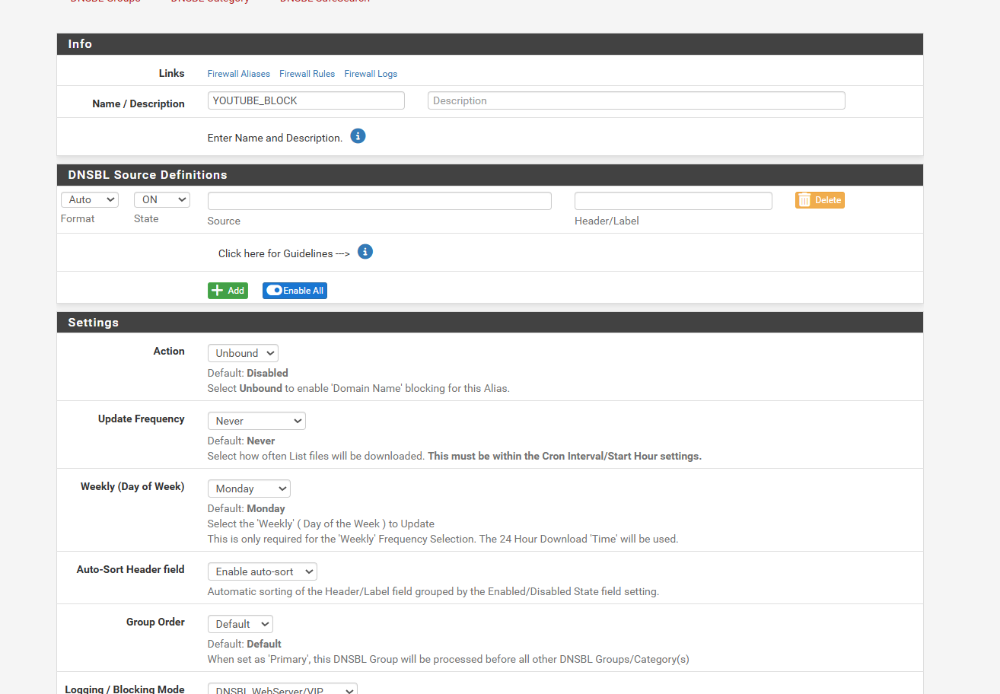

_(Shows YOUTUBE_BLOCK group settings — name, source definitions, action)_

#### Group settings

| Setting               | Value               |
| --------------------- | ------------------- |
| Name                  | YOUTUBE_BLOCK       |
| Action                | Unbound             |
| Update Frequency      | Never               |
| Auto-Sort             | Enable auto-sort    |
| Group Order           | Default             |
| Logging/Blocking Mode | DNSBL WebServer/VIP |

### The format dropdown error

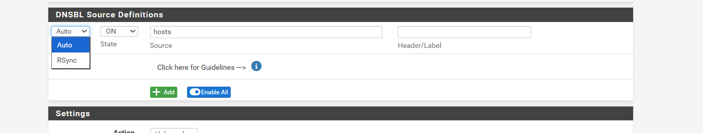

_(Shows Format dropdown with Auto and RSync options)_

During troubleshooting the Source Definition error, the Format
dropdown was investigated. Options available:

| Format   | Meaning                                  |
| -------- | ---------------------------------------- |
| **Auto** | pfBlockerNG auto-detects the list format |
| RSync    | Download via rsync protocol              |

**Auto** format was correct — the problem was not the format
setting but the source content itself (domain names entered
where a URL was expected).

### The Custom_List solution

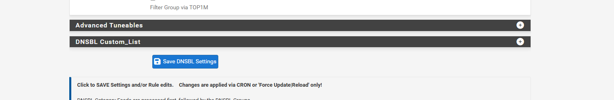

_(Shows DNSBL Custom_List section at bottom of DNSBL Category page)_

The **DNSBL Custom_List** section accepts raw domain names
entered directly — one per line. No URL or file download needed.

#### YouTube domains entered in Custom_List

```
youtube.com
www.youtube.com
m.youtube.com
ytimg.com
googlevideo.com
youtu.be
```

#### Why each domain is necessary

| Domain            | What it serves  | Effect if not blocked       |
| ----------------- | --------------- | --------------------------- |
| `youtube.com`     | Main website    | YouTube homepage accessible |
| `www.youtube.com` | www subdomain   | www.youtube.com accessible  |
| `m.youtube.com`   | Mobile site     | Mobile YouTube accessible   |
| `ytimg.com`       | Thumbnail CDN   | Video thumbnails still load |
| `googlevideo.com` | Video streaming | Videos still stream via CDN |
| `youtu.be`        | URL shortener   | Short links still work      |

Blocking only `youtube.com` would still allow videos to stream
through `googlevideo.com`. All six domains are required for
a complete YouTube block.

#### How Custom_List works internally

When Custom_List entries are saved and Force Reload is run:

1. pfBlockerNG writes the domains to Unbound's configuration
2. Unbound creates local-zone entries for each domain
3. Each entry returns `10.10.10.1` for any query matching that domain
4. No external download needed — it works offline

```
Unbound internal config (auto-generated by pfBlockerNG):
local-zone: "youtube.com" redirect
local-data: "youtube.com A 10.10.10.1"
local-zone: "googlevideo.com" redirect
local-data: "googlevideo.com A 10.10.10.1"
... (one entry per domain)
```

---

## Part 8 — Verification — YouTube Blocked

### The proof screenshot


_(Shows nslookup youtube.com returning 10.10.10.1 from pfSense DNS)_

```
C:\Users\MAYUR> nslookup youtube.com
Server:   pfSense.lab.local
Address:  192.168.20.1

Name:     youtube.com
Address:  10.10.10.1
```

### Line-by-line analysis

| Line    | Value             | What it proves                           |
| ------- | ----------------- | ---------------------------------------- |
| Server  | pfSense.lab.local | DNS query went to pfSense — not 8.8.8.8  |
| Address | 192.168.20.1      | pfSense LAN IP — DNS enforcement working |
| Name    | youtube.com       | The domain that was queried              |
| Address | **10.10.10.1**    | **Sinkhole IP — domain is blocked ✅**   |

### Three layers of proof in one screenshot

**Layer 1 — DNS enforcement:**
Server shows `pfSense.lab.local` at `192.168.20.1` — confirming
Rule 2+3 are working. The query was not allowed to reach 8.8.8.8.

**Layer 2 — DNSBL active:**
`youtube.com` returns `10.10.10.1` — pfBlockerNG Custom_List
intercepted the query and returned the sinkhole IP.

**Layer 3 — Bypass impossible:**
Since all DNS must go through pfSense, and pfSense returns
the sinkhole for youtube.com, there is no network-level
way to access YouTube from this network.

---

## Part 9 — pfBlockerNG Reports

### Screenshot


_(Shows Reports → Alerts tab with live DNSBL block log entries)_

### Navigation path

```
Firewall → pfBlockerNG → Reports → Alerts
```

### What the reports show

The Alerts tab shows live, real-time evidence that pfBlockerNG
is actively blocking DNS queries on the network.

#### DNSBL Block entries visible

| Time           | Source IP      | Device | Domain Blocked              | Feed            |
| -------------- | -------------- | ------ | --------------------------- | --------------- |
| May 2 00:15:31 | 192.168.20.103 | Mayur  | beacons4.gvt2.com           | StevenBlack_ADs |
| May 2 00:13:28 | 192.168.20.103 | Mayur  | beacons.gcp.gvt2.com        | StevenBlack_ADs |
| May 2 00:13:20 | 192.168.20.103 | Mayur  | googleads.g.doubleclick.net | StevenBlack_ADs |
| May 2 00:12:38 | 192.168.20.103 | Mayur  | beacons5.gvt2.com           | StevenBlack_ADs |
| May 2 00:12:38 | 192.168.20.103 | Mayur  | beacons4.gvt2.com           | StevenBlack_ADs |
| May 2 00:12:34 | 192.168.20.103 | Mayur  | beacons.gvt2.com            | StevenBlack_ADs |

#### What these blocked domains are

| Domain                      | Owner        | Purpose                            |
| --------------------------- | ------------ | ---------------------------------- |
| beacons.gvt2.com            | Google       | Chrome browser telemetry beacon    |
| beacons.gcp.gvt2.com        | Google Cloud | GCP usage beacon                   |
| googleads.g.doubleclick.net | Google Ads   | Advertising tracking (DoubleClick) |
| beacons4/5.gvt2.com         | Google       | Additional telemetry beacons       |

These were blocked **automatically** by the StevenBlack_ADs feed —
without any manual configuration. The Windows PC at
`192.168.20.103` was simply running a browser in the background,
and Chrome's automatic beacon calls were intercepted and sinkholed.

#### What "DNSBL-Full | -|PRI|HTTP/2.0|-" means

| Part       | Meaning                                |
| ---------- | -------------------------------------- |
| DNSBL-Full | Full DNSBL database used (not partial) |
| PRI        | Primary interface                      |
| HTTP/2.0   | Chrome was using HTTP/2 protocol       |

#### Available report tabs

The Reports page has multiple tabs:

| Tab               | Shows                               |
| ----------------- | ----------------------------------- |
| Unified           | All alerts combined                 |
| **Alerts**        | Individual block events (used here) |
| IP Block Stats    | Statistics on IP-based blocks       |
| IP Permit Stats   | Statistics on permitted IPs         |
| IP Match Stats    | Statistics on matched IPs           |
| DNSBL Block Stats | Statistics on DNSBL blocks          |

---

## Part 10 — How pfBlockerNG Integrates With Everything

### Full system integration diagram

```
CLIENT (192.168.20.103 — Windows PC)
         |
         | DNS query: youtube.com
         ▼
PFSENSE DNS RESOLVER (Unbound — 192.168.20.1:53)
         |
         | pfBlockerNG hook — check DNSBL lists
         ▼
IS youtube.com in any block list?
         |
    YES ─┤─ NO
         |         |
         ▼         ▼
Return        Forward to 8.8.8.8
10.10.10.1    (or Ubuntu BIND9
(sinkhole)     for .local domains)
         |
         ▼
CLIENT tries 10.10.10.1
         |
         ▼
pfBlockerNG lighttpd web server
Returns: Block page
         |
         ▼
YOUTUBE INACCESSIBLE ✅
```

### What pfBlockerNG hooks into

```
pfSense Unbound DNS Resolver
    └── pfBlockerNG DNSBL module
            ├── ADs_Basic group (StevenBlack — 16,998 domains)
            ├── YOUTUBE_BLOCK group (disabled)
            └── Custom_List (6 YouTube domains)
                    ├── youtube.com → 10.10.10.1
                    ├── www.youtube.com → 10.10.10.1
                    ├── m.youtube.com → 10.10.10.1
                    ├── ytimg.com → 10.10.10.1
                    ├── googlevideo.com → 10.10.10.1
                    └── youtu.be → 10.10.10.1
```

---

## Part 11 — Errors Faced and How They Were Fixed

### Error 1 — DNSBL Source Definition error

**When it happened:** When configuring the YOUTUBE_BLOCK group
and trying to add YouTube as a source.

**What was done (wrong):**
Entered `youtube.com` directly in the Source field of
DNSBL Source Definitions.

**Error shown:**

```
DNSBL Source Definition error (invalid URL)
```

**Root cause:**
The Source field expects a URL pointing to a downloadable
plain-text block list (like `https://somesite.com/blocklist.txt`).
Entering a domain name is not valid in this field.

**Fix applied:**
Disabled the invalid row in DNSBL Source Definitions.
Opened DNSBL Category → scrolled to bottom →
found **DNSBL Custom_List** section →
entered YouTube domains directly, one per line → saved →
ran Force Reload → All.

---

### Error 2 — pfBlockerNG not blocking after configuration

**When it happened:** After adding YouTube domains to Custom_List
and saving settings — `nslookup youtube.com` still returned
the real IP.

**Root cause:**
Changes to pfBlockerNG do not take effect until a Force
Update/Reload is run. The settings were saved but Unbound's
configuration had not been regenerated yet.

**Fix applied:**

```
Firewall → pfBlockerNG → Update
Force option: ● Reload
Reload option: ● All
→ Run
```

After Force Reload completed, `nslookup youtube.com` immediately
returned `10.10.10.1`.

**Lesson learned:** Every time pfBlockerNG settings change,
Force Reload → All must be run. CRON handles automatic daily
updates but not immediate changes.

---

### Error 3 — Database Sanity check FAILED on first run

**When it happened:** First Force Update after wizard completion.

**Error shown:**

```
Database Sanity check [ FAILED ]
Masterfile Count  [ 16998 ]
Deny folder Count [ 16997 ]
```

**Root cause:**
A one-entry count mismatch on the very first database build.
The database write completes asynchronously and the count is
taken slightly before the last entry is written.

**Fix applied:**
None needed. The error resolved itself on the next update run.
The DNSBL was fully functional despite this message.

---

## Summary — pfBlockerNG Achievement

| Metric                 | Value                                     |
| ---------------------- | ----------------------------------------- |
| Package version        | pfBlockerNG 3.2.8                         |
| DNSBL mode             | Unbound mode                              |
| Sinkhole IP            | 10.10.10.1                                |
| Active feed            | StevenBlack_ADs                           |
| Domains from feed      | 16,998                                    |
| Custom blocked domains | 6 (YouTube + CDNs)                        |
| Total domains blocked  | 17,004+                                   |
| Bypass possible        | ❌ No — DNS enforcement prevents it       |
| Verified by            | nslookup returning 10.10.10.1             |
| Live proof             | Reports → Alerts showing real-time blocks |

---

## What This Demonstrates

Configuring pfBlockerNG at this level demonstrates:

- Understanding of DNS-based content filtering vs IP-based filtering
- How DNS sinkholes work and why they are effective
- pfBlockerNG installation, wizard configuration, and manual setup
- Difference between group-based sources and Custom_List entries
- Understanding of why multiple CDN domains must be blocked for
  complete domain blocking
- Force Update vs Force Reload — knowing which to use when
- Reading and interpreting pfBlockerNG logs and reports
- Real-world troubleshooting — source definition error, timing of
  reload, sanity check errors
- How pfBlockerNG integrates with Unbound DNS at a technical level

These skills are directly applicable to enterprise security roles
where DNS filtering, threat intelligence feed management, and
content policy enforcement are common responsibilities. Tools
like Cisco Umbrella, Palo Alto DNS Security, and Infoblox
BloxOne all operate on the same DNS sinkholing principles
demonstrated in this project.

---

_Document: 05-PFBLOCKERNG-SETUP.md_
_Project: Mini Enterprise Network_
_Author: Mayur Garje_
_Date: May 2026_
